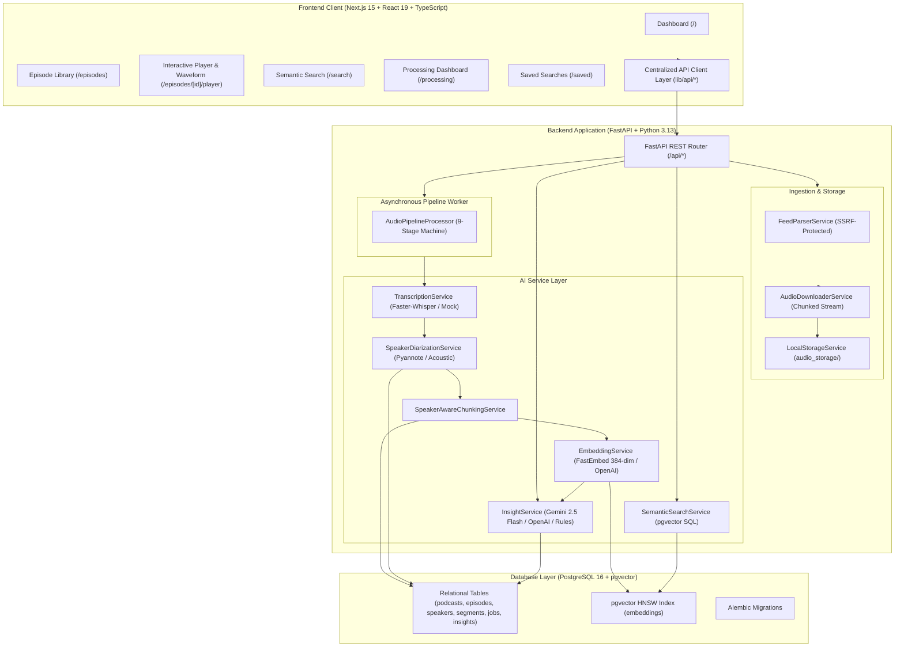

# 🎙️ Podcast Explorer

> **AI-Powered Podcast Intelligence & Semantic Search Platform**  
> Transform long-form technical conversations into structured, searchable, and speaker-aware engineering knowledge.

[](https://nextjs.org/)
[](https://react.dev/)
[](https://www.typescriptlang.org/)
[](https://fastapi.tiangolo.com/)
[](https://www.python.org/)
[](https://www.postgresql.org/)
[](https://github.com/pgvector/pgvector)
[](https://docs.pytest.org/)

---

## 🎯 Problem & Motivation

Podcasts contain dense technical, architectural, and engineering insights. However, traditional podcast applications are built strictly for sequential, linear listening. This creates major friction for technical professionals:

- **Unsearchable Knowledge**: Traditional keyword search fails when queries use conceptual synonyms (e.g. searching for *"database bottleneck"* misses discussions about *"synchronous connection pool starvation on writer replicas"*).
- **Time-Consuming Scrubbing**: Pinpointing a specific architectural trade-off or war story in a 90-minute episode requires tedious manual scrubbing.
- **Lost Speaker Attribution**: Raw transcripts discard who made a specific claim, when speaker transitions occurred, and how much speaking time was allocated.
- **Disconnected Summaries**: Text summaries frequently lose deep-linkable connections to exact audio timestamps.

**Podcast Explorer** solves this by decomposing long-form podcast audio through a structured, multi-stage intelligence pipeline:

```
Podcast RSS / Audio Upload
          ↓
  Episode Metadata
          ↓
Chunked Audio Stream
          ↓
Speech-to-Text Transcription (Faster-Whisper / Monotonic Timestamps)
          ↓
Speaker Diarization (Pyannote / Speaker 1, Speaker 2, Speaker 3)
          ↓
Speaker-Aware Temporal Chunking
          ↓
Dense Vector Embeddings (FastEmbed BAAI/bge-small-en-v1.5)
          ↓
PostgreSQL pgvector HNSW Indexing
          ↓
Natural Language Semantic Search & Direct Audio Deep-Linking
          ↓
AI Architectural Insights (Gemini 2.5 Flash / OpenAI / Rule-Based)
```

---

## ✨ Product Preview

The application combines a high-contrast dark aesthetic with interactive audio-transcript synchronization:

- **Telemetry Dashboard (`/`)**: Real-time overview of indexed audio hours, active worker tasks, pgvector index status, recent episodes, and semantic query shortcuts.
- **Episode Library & RSS Ingestion (`/episodes`)**: Multi-status library (All, Indexed, Processing, Failed) with both direct multipart audio upload and an automated RSS feed import modal.
- **Interactive Audio Player & Waveform (`/episodes/[id]/player`)**: Multi-track timeline with amplitude waveform, speaker spotlight borders, playback speed controls, and bidirectional audio-transcript seeking.
- **Semantic Concept Search (`/search`)**: Natural language retrieval powered by pgvector similarity distance with match percentages, speaker badges, and 1-click `"Play Match"` navigation.
- **Processing Pipeline Monitor (`/processing`)**: Real-time 9-stage asynchronous pipeline tracker with progress bars, cancellation, failure logs, and idempotent retry actions.
- **AI Episode Insights Modal**: Dynamic technical extraction structured into 5 concrete sections (Overview, Target Competencies, Core Technology Stack, Architectural Blueprint, and Resume Transformation bullets).
- **Saved Searches (`/saved`)**: Persisted query workbench with execution counters and single-click re-runs.

---

## 🚀 Core Features

### 🎧 Podcast Ingestion & RSS Parsing
- **RSS & Atom Feed Ingestion**: Imports full podcast shows from standard RSS 2.0, Atom, and Apple Podcasts XML feeds (`POST /api/podcasts/import`).
- **SSRF Protection & URL Validation**: Validates feed URL schemes (`http`/`https`), rejects private/internal IP address spaces (`127.0.0.0/8`, `10.0.0.0/8`, `172.16.0.0/12`, `192.168.0.0/16`, `169.254.169.254`), and verifies DNS resolution before fetching.
- **GUID Deduplication**: Automatically deduplicates episodes using feed GUIDs, enclosure URLs, or clean title hashing to prevent duplicate database rows.
- **Direct Audio Upload**: Supports multipart uploads for MP3, WAV, M4A, AAC, and FLAC (up to 250MB) with strict MIME and extension validation.

### 📥 Chunked Audio Streaming & Storage
- **Low-Memory Streaming**: Downloads remote episode audio in 64KB chunks directly to disk (`POST /api/episodes/{id}/download`), avoiding in-memory buffering of large audio files.
- **Atomic File Handling & Cleanup**: Streams into temporary `.tmp` files and automatically cleans up partial files on network aborts or failures.
- **Storage Abstraction**: Configured via `AudioStorageService` interface, allowing local disk persistence (`./audio_storage`) or future object store backends (S3 / GCS).

### 🎙️ Speech-to-Text & Speaker Diarization
- **Transcription Service Abstraction**: Pluggable provider architecture (`TRANSCRIPTION_PROVIDER=faster_whisper` or `mock`) delivering monotonic timestamped segments (`start_time`, `end_time`).
- **Speaker Diarization**: Detects distinct voices (`DIARIZATION_PROVIDER=pyannote`, `acoustic`, or `mock`), standardizes speaker labels (`Speaker 1`, `Speaker 2`, `Speaker 3`), and aggregates speaking duration and segment counts.
- **Speaker Renaming**: Allows display names to be edited and persisted (`PATCH /api/episodes/{id}/speakers/{speaker_id}`).

### ⏱️ Speaker-Aware Temporal Chunking
- **Speaker-Boundary Windows**: Partitions continuous transcripts at speaker transitions and semantic pauses rather than arbitrary character splits.
- **Timestamp Integrity**: Preserves exact floating-point second offsets (`start_time` and `end_time`) on every single transcript chunk.

### 🔎 pgvector Semantic Search
- **Dense Vector Embeddings**: Uses FastEmbed (`BAAI/bge-small-en-v1.5`, 384 dimensions) or OpenAI embeddings with ONNX runtime execution (`EMBEDDING_PROVIDER=fastembed`).
- **Native SQL Cosine Distance**: Executes similarity queries directly in PostgreSQL (`1.0 - Embedding.embedding.cosine_distance(query_vector)`), utilizing HNSW vector indexes (`vector_cosine_ops`).
- **Filtering & Ranking**: Filters by similarity threshold, project scope, and specific speakers with microsecond-level query execution.

### 🎵 Bidirectional Audio-Transcript Playback
- **Timestamp Deep-Linking**: Search results and chapter links deep-link directly to exact playback seconds via URL query parameters (`/episodes/[id]/player?t=112.4`).
- **Interactive Transcript Scrubbing**: Clicking any dialogue timestamp immediately seeks the audio player to that exact moment.
- **Synchronized Spotlight**: Automatically highlights the active speaker and smoothly scrolls the transcript during playback.

### 🧠 AI Episode Intelligence & Insights
- **Context Aggregation Strategy**: Samples transcript segments across the conversation to synthesize dense technical intelligence without token overflow.
- **Structured JSON Schema Output**:
  1. **Overview**: Executive summary of technical themes discussed.
  2. **Target Competencies**: Core software engineering competencies demonstrated.
  3. **Core Technology Stack**: Detected frameworks, databases, libraries, and protocols.
  4. **Architectural Blueprint**: Concrete architectural patterns, trade-offs, and design decisions.
  5. **Resume Transformation**: High-impact bullet point ready for portfolio or resume use.
- **Configurable LLM Backends**: Supports Google Gemini (`gemini-2.5-flash`), OpenAI, or deterministic rule-based analysis (`INSIGHT_PROVIDER=auto`).

### ⚙️ Asynchronous Processing Pipeline
- **9-Stage Resilient Lifecycle**:
  `queued` $\rightarrow$ `downloading` $\rightarrow$ `transcribing` $\rightarrow$ `speaker_detection` $\rightarrow$ `chunking` $\rightarrow$ `embedding` $\rightarrow$ `indexing` $\rightarrow$ `insights` $\rightarrow$ `completed` (or `failed`).
- **Cancellation & Retries**: Supports background task cancellation (`POST /api/processing/jobs/{id}/cancel`) and idempotent retries (`POST /api/processing/jobs/{id}/retry`) that safely wipe partial child records before reprocessing.

### 💾 Saved Searches, Workspaces & Notifications
- **Persisted Saved Queries**: Full CRUD and execution endpoints for saved searches (`/api/search/saved`).
- **Project Workspaces**: Partition audio libraries into scoped collections (`/api/projects`).
- **In-App Notification Center**: Tracks background pipeline completions, failures, and indexing events (`/api/notifications`).

---

## 🏗️ System Architecture



---

## 📊 Database Schema & Entities

The persistence layer uses SQLAlchemy ORM with PostgreSQL and the `pgvector` extension:

| Table | Description | Primary Key & Foreign Keys |
|---|---|---|
| `podcasts` | Show-level metadata (title, author, feed URL, website, artwork) | `id` |
| `episodes` | Episode metadata, audio reference, duration, publication date, status, GUID | `id`, `podcast_id` $\rightarrow$ `podcasts.id`, `project_id` $\rightarrow$ `projects.id` |
| `speakers` | Identified voices (`Speaker 1`, `Speaker 2`), display names, speaking duration | `id`, `episode_id` $\rightarrow$ `episodes.id` |
| `transcript_segments` | Timestamped dialogue segments (`start_time`, `end_time`, `sequence_number`) | `id`, `episode_id` $\rightarrow$ `episodes.id`, `speaker_id` $\rightarrow$ `speakers.id` |
| `embeddings` | 384-dimensional dense vector embeddings with HNSW cosine index | `id`, `segment_id` $\rightarrow$ `transcript_segments.id` |
| `episode_insights` | Structured AI blueprints, competencies, technologies, resume bullets | `id`, `episode_id` $\rightarrow$ `episodes.id` |
| `processing_jobs` | Background pipeline tracking stage, percentage progress, duration, error logs | `id`, `episode_id` $\rightarrow$ `episodes.id` |
| `projects` | Organization workspaces partitioning audio collections | `id`, `user_id` $\rightarrow$ `users.id` |
| `saved_searches` | Persisted queries, filter configurations, run counts, execution timestamps | `id`, `user_id` $\rightarrow$ `users.id` |
| `notifications` | In-app alerts for pipeline events, failures, and search updates | `id`, `user_id` $\rightarrow$ `users.id` |
| `users` | User accounts and preferences | `id` |

---

## 🔌 API Reference

### Podcasts & Ingestion
- `POST /api/podcasts/import` — Ingest podcast show and episodes from RSS feed URL
- `GET /api/podcasts` — List all imported podcast shows
- `GET /api/podcasts/{id}` — Get single podcast show and episodes
- `DELETE /api/podcasts/{id}` — Delete podcast show and cascade episodes

### Episodes & Audio
- `POST /api/episodes` — Multipart audio file upload
- `GET /api/episodes` — List all episodes (supports `project_id`, `podcast_id`, `status`, `q`, `skip`, `limit`)
- `GET /api/episodes/{id}` — Get episode metadata and processing telemetry
- `PATCH /api/episodes/{id}` — Update episode title, description, or project
- `DELETE /api/episodes/{id}` — Delete episode and cascade child records
- `POST /api/episodes/{id}/download` — Stream download audio from remote audio URL
- `GET /api/episodes/{id}/audio` — Retrieve stored audio file stream
- `GET /api/episodes/{id}/transcript` — Fetch timestamped dialogue segments
- `GET /api/episodes/{id}/speakers` — Fetch identified speaker profiles
- `PATCH /api/episodes/{id}/speakers/{speaker_id}` — Rename speaker display name
- `POST /api/episodes/{id}/process` — Trigger background processing pipeline

### Semantic Search & Saved Searches
- `POST /api/search` — Execute pgvector cosine similarity search (`query`, `threshold`, `project_id`, `speaker_ids`, `limit`)
- `GET /api/search/saved` — List saved searches for current user
- `POST /api/search/saved` — Create new saved search
- `GET /api/search/saved/{id}` — Get single saved search
- `PATCH /api/search/saved/{id}` — Update saved search
- `DELETE /api/search/saved/{id}` — Delete saved search
- `POST /api/search/saved/{id}/run` — Run saved search and update execution count

### AI Episode Insights
- `GET /api/episodes/{id}/insights` — Retrieve or synthesize AI architectural insights
- `POST /api/episodes/{id}/insights/generate` — Force re-synthesis of AI insights

### Background Processing
- `GET /api/processing/jobs` — List all processing jobs
- `GET /api/processing/jobs/{id}` — Get single job progress and error telemetry
- `POST /api/processing/jobs/{id}/retry` — Safely retry a failed or stalled processing job
- `POST /api/processing/jobs/{id}/cancel` — Cancel an active background processing task
- `GET /api/processing/stats` — Get active worker and queue telemetry

### Notifications, Projects & System Health
- `GET /api/notifications` — List notifications
- `PATCH /api/notifications/{id}/read` — Mark notification as read
- `POST /api/notifications/read-all` — Mark all notifications as read
- `GET /api/projects` | `POST /api/projects` | `GET /api/projects/{id}` — Project workspace management
- `GET /api/health` — System and database health check

---

## 🛠️ Technology Stack

### Frontend
- **Framework**: Next.js 15.5 (App Router, Client & Server Components)
- **Library**: React 19.2
- **Language**: TypeScript 5.9
- **Styling**: Tailwind CSS 4.1 with custom dark design tokens
- **Icons**: Lucide React
- **Motion**: Motion (Framer Motion 12.23)

### Backend
- **Framework**: FastAPI 0.111 / Starlette
- **Server**: Uvicorn 0.30
- **Language**: Python 3.13 / 3.11+
- **Database & ORM**: PostgreSQL 16+, SQLAlchemy 2.0, Psycopg2 / Asyncpg
- **Vector Search Engine**: pgvector 0.3+ with HNSW cosine distance indexing
- **Migrations**: Alembic 1.13
- **Embeddings**: FastEmbed 0.3+ (`BAAI/bge-small-en-v1.5`, ONNX Runtime)
- **Speech-to-Text**: Faster-Whisper / OpenAI Whisper abstractions
- **Diarization**: Pyannote Audio / Acoustic feature diarization abstractions
- **LLM Insights**: Google Gemini (`@google/genai` 2.4+) / OpenAI / Rule-Based engine
- **Feed Parser**: Feedparser 6.0+ with SSRF protection
- **Testing**: Pytest 9.1, AnyIO, Typeguard, Starlette TestClient

---

## ⚡ Quickstart & Local Setup

### Prerequisites
- **Node.js** >= 18.18.0
- **Python** >= 3.11 (Python 3.13 recommended)
- **PostgreSQL 16+** with `pgvector` extension enabled

### 1. Clone & Configure Environment

```bash
git clone https://github.com/Saurx9611/Podcast-Episode-Explorer.git
cd Podcast-Episode-Explorer

# Copy environment template
cp .env.example .env
```

Edit `.env` to configure your PostgreSQL credentials and AI keys:

```ini
# Database (PostgreSQL + pgvector)
POSTGRES_SERVER=localhost
POSTGRES_PORT=5432
POSTGRES_USER=postgres
POSTGRES_PASSWORD=postgres
POSTGRES_DB=podcast_explorer

# Storage & Upload Limits
STORAGE_PATH=./audio_storage
MAX_UPLOAD_SIZE_MB=250

# Provider Switches
EMBEDDING_PROVIDER=fastembed       # "fastembed", "mock", "openai"
EMBEDDING_DIMENSION=384
TRANSCRIPTION_PROVIDER=mock        # "faster_whisper", "whisper", "mock"
DIARIZATION_PROVIDER=mock          # "pyannote", "acoustic", "mock"
INSIGHT_PROVIDER=auto              # "gemini", "openai", "auto", "mock"

# Optional External API Keys
GEMINI_API_KEY=
OPENAI_API_KEY=
HUGGINGFACE_AUTH_TOKEN=

# Frontend Configuration
NEXT_PUBLIC_API_URL=http://localhost:8000/api
```

### 2. Backend Setup & Startup

```bash
# Create and activate virtual environment
python -m venv .venv
source .venv/bin/activate  # On Windows: .venv\Scripts\activate

# Install dependencies
pip install -r backend/requirements.txt

# Run database migrations
alembic upgrade head

# Start FastAPI server
python -m uvicorn backend.main:app --host 127.0.0.1 --port 8000 --reload
```

Backend will be active at [http://127.0.0.1:8000](http://127.0.0.1:8000).  
Interactive Swagger API docs available at [http://127.0.0.1:8000/api/docs](http://127.0.0.1:8000/api/docs).

### 3. Frontend Setup & Startup

In a separate terminal:

```bash
# Install Node dependencies
npm install

# Start Next.js development server
npm run dev
```

Open [http://localhost:3000](http://localhost:3000) in your browser.

---

## 🧪 Verification & Testing

### Run Backend Test Suite

```bash
# Run all 83 backend unit and integration tests
python -m pytest backend/tests -v
```

### Run Frontend Typecheck & Production Build

```bash
# Verify TypeScript types and compile Next.js production bundle
npm run build
```

---

## 📄 License

This project is licensed under the [MIT License](LICENSE).
