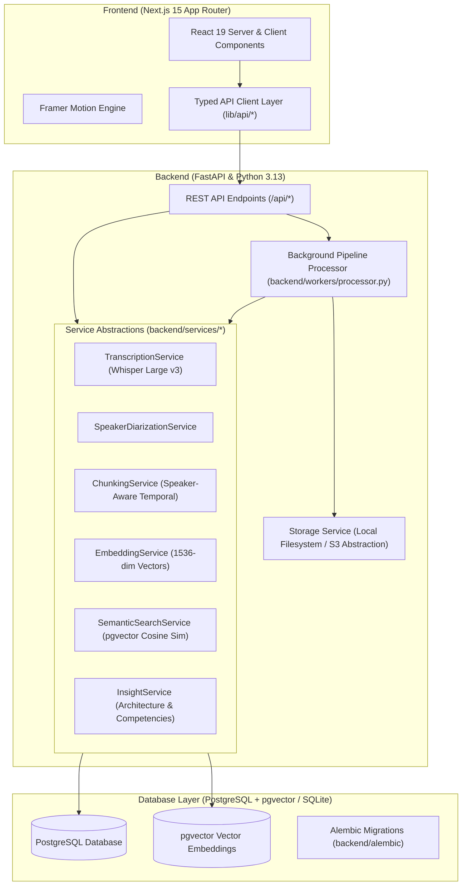

# 🎙️ Podcast Explorer

> An AI-powered podcast intelligence platform for transforming long-form technical conversations into searchable, speaker-aware, timestamped knowledge.

[](https://nextjs.org/)
[](https://react.dev/)
[](https://www.typescriptlang.org/)
[](https://fastapi.tiangolo.com/)
[](https://www.python.org/)
[](https://www.postgresql.org/)
[](https://github.com/pgvector/pgvector)
[](https://docs.pytest.org/)

---

## 💡 Overview

Long-form technical podcasts (system design interviews, engineering deep dives, architecture case studies) contain dense engineering wisdom. However, traditional audio consumption suffers from fundamental limitations:
- **Linear Listening**: Locating a specific trade-off or war story in a 90-minute episode requires tedious scrubbing.
- **Keyword Search Failures**: Keyword searches miss conceptual synonyms (e.g. searching for *"database bottleneck"* misses a discussion about *"connection saturation on writer nodes"*).
- **Missing Speaker Context**: Traditional transcripts discard who said what and when transitions occurred.
- **Loss of Temporal Anchors**: Text summaries lose deep-linkable connections to the source audio.

**Podcast Explorer** bridges this gap with an asynchronous end-to-end intelligence pipeline:

$$\text{Audio Upload} \longrightarrow \text{Transcription} \longrightarrow \text{Speaker Diarization} \longrightarrow \text{Temporal Chunking} \longrightarrow \text{1536-dim Embeddings} \longrightarrow \text{pgvector Indexing} \longrightarrow \text{Semantic Retrieval} \longrightarrow \text{Deep-Linked Audio Seeking}$$

---

## ✨ Signature Spatial-Temporal Interaction

Podcast Explorer implements a tightly coupled interaction model that unifies **Audio**, **Time**, **Transcript**, **Speaker**, and **Search**:

- **Connected Multi-Track Waveform Timeline**: An interactive 120-bar amplitude waveform with color-coded speaker tracks embedded directly into the playback ribbon (Emerald for Priya Shah, Indigo for Alex Morgan, Amber for Daniel Chen).
- **Bidirectional Temporal Coupling**:
  - *Audio Playback $\rightarrow$ Transcript Stream*: As audio progresses, the active dialogue segment enters a high-contrast spotlight with a glowing speaker accent border, while non-active dialogue subtly de-emphasizes.
  - *Transcript Scrubbing $\rightarrow$ Audio Deck*: Clicking any timestamp jumps the audio timeline, aligns the playhead, and focuses the active speaker spotlight.
  - *Smart Viewport Tracking*: The transcript smoothly auto-scrolls the active segment into view during playback without jittering if the user is manually inspecting another section.
- **Search Query Projection**: Searching for a term (e.g., `"database"`) highlights text matches in dialogue and projects glowing timestamp tick marks across the waveform timeline.

---

## 🚀 Key Features

### 🎧 Episode Intelligence & Diarization
- **Audio Ingestion**: Multipart audio uploads supporting MP3, WAV, M4A, AAC, and FLAC (up to 250MB) with MIME type and size validation.
- **Speaker Diarization**: Multi-speaker boundary detection with proportional speaking duration breakdown bars and speaker renaming support.
- **Speaker-Aware Temporal Chunking**: Splits audio into cohesive segments bounded by speaker transitions and semantic coherence rather than arbitrary character counts.

### 🔎 Semantic Concept Search (pgvector)
- **Vector Similarity Retrieval**: 1536-dimensional embedding search using cosine distance (`<=>` operator) in PostgreSQL with pgvector.
- **Configurable Similarity Threshold**: Real-time slider (10%–90%) to widen or narrow precision.
- **Project & Speaker Filtering**: Restrict queries to specific collections or individual speakers.
- **Timestamped Match Navigation**: Each search result renders the matched quote, context, speaker, and a single-click `"Play Match"` trigger that seeks directly to the source audio timestamp.

### 🧠 AI Technical Episode Insights (`GET /api/episodes/{id}/insights`)
- **Target Competencies**: Key engineering domains covered in the conversation.
- **Core Technology Stack**: Detected frameworks, databases, and architectural tooling.
- **Architectural Blueprint**: Step-by-step structural decisions and patterns.
- **Resume Impact Transformation**: High-impact bullet point ready to copy.

### ⚙️ Asynchronous Processing Pipeline
- **6-Stage Worker Architecture**: `Queued` $\rightarrow$ `Transcribing` $\rightarrow$ `Identifying speakers` $\rightarrow$ `Temporal chunking` $\rightarrow$ `Generating embeddings` $\rightarrow$ `Vector indexing`.
- **Live Pipeline Monitor**: Real-time progress percentages, failure boundaries, job retry, job cancellation, and low-level telemetry logs.

### 💾 Saved Searches & Workspaces
- **Persistent Saved Queries**: Store frequently used queries with custom descriptions and filters.
- **Single-Engine Execution**: Saved searches reuse the exact same `SemanticSearchService` as live search.
- **Project Workspaces**: Partition episode libraries into logical collections.

### 🔔 In-App Notifications & Settings Persistence
- **Notification Center**: Real-time notification popover tracking job lifecycle events (`processing_started`, `processing_completed`, `processing_failed`, `saved_search_result`).
- **Full Settings Persistence**: General, Processing, Search, and Account preferences backed by database persistence and API endpoints.

---

## 🏗️ System Architecture



---

## 📊 Database Schema

The database uses **Alembic** migrations (`backend/alembic/versions/001_initial_schema.py`) and SQLAlchemy ORM models (`backend/models/`):

| Table | Description |
| :--- | :--- |
| `users` | User accounts and workspace settings |
| `projects` | Organization workspaces partitioning episode libraries |
| `episodes` | Audio file metadata, duration, processing status, and storage references |
| `speakers` | Identified voices, display labels, speaking duration, and segment counts |
| `transcript_segments` | Timestamped dialogue segments with `start_time`, `end_time`, `speaker_id`, and `sequence_number` |
| `embeddings` | 1536-dimensional float vector embeddings linked to transcript segments |
| `processing_jobs` | Background pipeline tracking stage, percentage progress, duration, and error logs |
| `saved_searches` | Persisted semantic queries, filters, run counts, and last executed timestamps |
| `notifications` | In-app alerts for pipeline completions, errors, and system events |
| `episode_insights` | AI-synthesized architectural blueprints, competencies, technologies, and resume bullets |

---

## 🔌 API Reference

### Episodes
- `POST /api/episodes` — Multipart audio file upload
- `GET /api/episodes` — List all episodes (supports status and project filtering)
- `GET /api/episodes/{id}` — Fetch episode metadata and processing telemetry
- `DELETE /api/episodes/{id}` — Delete episode and cascade associated records
- `GET /api/episodes/{id}/transcript` — Fetch timestamped dialogue segments
- `GET /api/episodes/{id}/speakers` — Fetch identified speaker profiles
- `GET /api/episodes/{id}/processing` — Get live processing stage and progress
- `POST /api/episodes/{id}/process` — Trigger processing pipeline
- `GET /api/episodes/{id}/insights` — Generate or retrieve technical architectural insights

### Semantic Search & Saved Queries
- `POST /api/search` — Perform vector similarity search (query, project scope, similarity threshold, limit)
- `GET /api/search/saved` — List saved searches
- `POST /api/search/saved` — Create a new saved search
- `GET /api/search/saved/{id}` — Get single saved search
- `PATCH /api/search/saved/{id}` — Update saved search query and metadata
- `DELETE /api/search/saved/{id}` — Delete saved search
- `POST /api/search/saved/{id}/run` — Execute saved search and record execution telemetry

### Projects, Notifications & Settings
- `GET /api/projects` | `POST /api/projects` | `GET /api/projects/{id}` — Project workspace management
- `GET /api/notifications` — List notifications
- `PATCH /api/notifications/{id}/read` — Mark single notification as read
- `POST /api/notifications/read-all` — Mark all notifications as read
- `GET /api/settings` | `PUT /api/settings` — Workspace configuration persistence
- `GET /api/health` — System and database health check

---

## 🛠️ Tech Stack

### Frontend
- **Framework**: [Next.js 15.5](https://nextjs.org/) (App Router, Server & Client Components)
- **Library**: [React 19.2](https://react.dev/)
- **Language**: [TypeScript 5.9](https://www.typescriptlang.org/)
- **Styling**: [Tailwind CSS 4.1](https://tailwindcss.com/) with custom dark design tokens
- **Icons**: [Lucide React](https://lucide.dev/)
- **Motion**: [Motion (Framer Motion 12.23)](https://motion.dev/)

### Backend
- **Framework**: [FastAPI 0.111](https://fastapi.tiangolo.com/)
- **Server**: [Uvicorn 0.30](https://www.uvicorn.org/)
- **Language**: [Python 3.13](https://www.python.org/)
- **Database & ORM**: [SQLAlchemy 2.0](https://www.sqlalchemy.org/), [PostgreSQL 16](https://www.postgresql.org/), [SQLite](https://www.sqlite.org/) (development)
- **Vector Search**: [pgvector 0.3](https://github.com/pgvector/pgvector)
- **Migrations**: [Alembic 1.13](https://alembic.sqlalchemy.org/)
- **Validation**: [Pydantic 2.7](https://docs.pydantic.dev/) & `pydantic-settings`
- **Testing**: [Pytest 9.1](https://docs.pytest.org/), `httpx`, `typeguard`

---

## ⚡ Getting Started

### Prerequisites
- **Node.js** >= 18.18.0
- **Python** >= 3.11 (Python 3.13 recommended)
- **PostgreSQL with pgvector** (or SQLite for local development)

### 1. Clone the Repository
```bash
git clone https://github.com/your-username/podcast-episode-explorer.git
cd podcast-episode-explorer
```

### 2. Environment Configuration
Copy the template configuration:
```bash
cp .env.example .env
```
Default settings support immediate development with local SQLite or PostgreSQL.

### 3. Backend Setup
```bash
# Create and activate virtual environment
python -m venv .venv
source .venv/bin/activate  # On Windows: .venv\Scripts\activate

# Install dependencies
pip install -r backend/requirements.txt

# Run database migrations
alembic upgrade head

# Seed initial demonstration data
python backend/seed.py

# Start FastAPI server
python -m uvicorn backend.main:app --host 127.0.0.1 --port 8000 --reload
```

### 4. Frontend Setup
```bash
# Install Node dependencies
npm install

# Start Next.js development server
npm run dev
```

Open [http://localhost:3000](http://localhost:3000) in your browser.

---

## 🧪 Verification & Testing

The backend test suite covers all CRUD operations, upload validations, temporal chunking, speaker diarization, pgvector search ranking, saved search executions, and settings lifecycles:

```bash
# Run all 40 backend pytest suites
python -m pytest backend/tests -v
```

```bash
# Run TypeScript compilation check
npx tsc --noEmit

# Run Next.js production build
npm run build
```

---

## 📄 License

This project is open source and available under the [MIT License](LICENSE).
