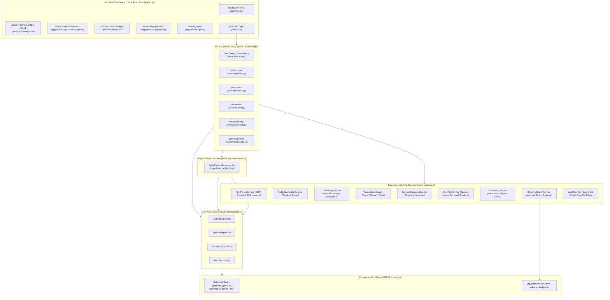
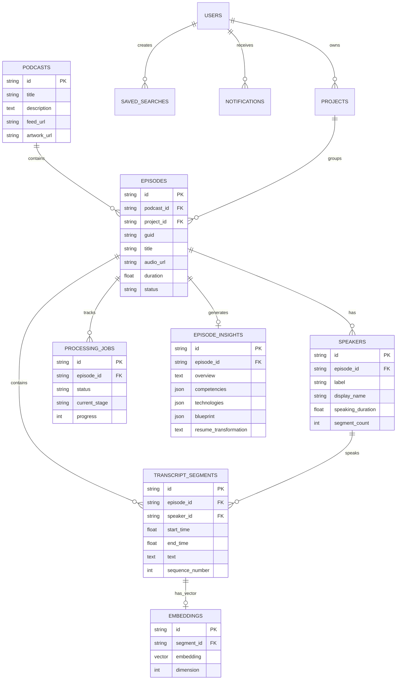

# 🎙️ Podcast Explorer — Comprehensive Technical Interview Preparation Guide

> **Confidential Interview Preparation Guide for Software Engineering, Data & AI Internship Candidates**  
> *Repository-Specific Forensic Analysis, Architecture Walkthroughs, AI Pipeline Explanations, Trade-offs, and Complete Question Bank.*

---

# 📑 Table of Contents

1. [Executive Summary & Verbal Pitches](#1-executive-summary--verbal-pitches)
   - [One-Sentence Pitch](#one-sentence-pitch)
   - [30-Second Elevator Pitch](#30-second-elevator-pitch)
   - [1-Minute Interview Pitch](#1-minute-interview-pitch)
   - [3-Minute Deep Dive Explanation](#3-minute-deep-dive-explanation)
2. [Actual Technology Inventory & Rationale](#2-actual-technology-inventory--rationale)
3. [System Architecture & Design Patterns](#3-system-architecture--design-patterns)
   - [Architectural Topology (Mermaid)](#architectural-topology)
   - [Layer Responsibilities & Code References](#layer-responsibilities--code-references)
   - [Applied Software Design Patterns](#applied-software-design-patterns)
4. [End-to-End Data Flow Forensic Analysis](#4-end-to-end-data-flow-forensic-analysis)
5. [AI & ML Pipelines Deep Dive](#5-ai--ml-pipelines-deep-dive)
   - [Speech-to-Text Transcription](#speech-to-text-transcription)
   - [Speaker Diarization & Labeling](#speaker-diarization--labeling)
   - [Speaker-Aware Temporal Chunking](#speaker-aware-temporal-chunking)
   - [Dense Embeddings & Vector Representations](#dense-embeddings--vector-representations)
   - [PostgreSQL pgvector & HNSW Cosine Search](#postgresql-pgvector--hnsw-cosine-search)
   - [LLM Episode Insights & Structured Synthesis](#llm-episode-insights--structured-synthesis)
6. [Database Schema & Data Modeling](#6-database-schema--data-modeling)
   - [Entity-Relationship Diagram](#entity-relationship-diagram)
   - [Model Breakdown & Table Schema](#model-breakdown--table-schema)
   - [Why PostgreSQL over MongoDB / SQLite](#why-postgresql-over-mongodb--sqlite)
7. [Frontend Architecture & Spatial-Temporal Playback](#7-frontend-architecture--spatial-temporal-playback)
8. [Asynchronous Processing & Worker Mechanics](#8-asynchronous-processing--worker-mechanics)
9. [Security, Ingestion Bounds & Hardening](#9-security-ingestion-bounds--hardening)
10. [Real Engineering Challenges & Solutions](#10-real-engineering-challenges--solutions)
11. [Scalability & System Evolution (1 Million Episodes)](#11-scalability--system-evolution-1-million-episodes)
12. [Comprehensive Interview Question Bank (100+ Questions)](#12-comprehensive-interview-question-bank-100-questions)
    - [Level 1: Fundamentals (20 Qs)](#level-1-fundamentals-20-questions)
    - [Level 2: Intermediate Architecture & Data (30 Qs)](#level-2-intermediate-architecture--data-30-questions)
    - [Level 3: Advanced AI, Vectors & Scaling (30 Qs)](#level-3-advanced-ai-vectors--scaling-30-questions)
    - [Level 4: Code-Level Forensic Questions (20+ Qs)](#level-4-code-level-forensic-questions)
13. [Deep Answer Scripts & Interviewer Follow-ups](#13-deep-answer-scripts--interviewer-follow-ups)
14. [Behavioral & STAR Engineering Stories](#14-behavioral--star-engineering-stories)
15. [Resume Bullet Defense Guide](#15-resume-bullet-defense-guide)
17. [Revision Checklists & 1-Page Cheat Sheet](#17-revision-checklists--1-page-cheat-sheet)
18. [Senior Interviewer Forensic Evaluation & Gaps](#18-senior-interviewer-forensic-evaluation--gaps)
19. [🎯 INTERVIEWER ATTACK QUESTIONS (30 Hard Code-Level Questions)](#19--interviewer-attack-questions-30-hard-code-level-questions)
20. [🧑💻 MOCK INTERVIEW ORDER (Realistic 45-Minute Sequence)](#20--mock-interview-order-realistic-45-minute-sequence)

---

# 1. Executive Summary & Verbal Pitches

### One-Sentence Pitch
> *"Podcast Explorer is an AI-powered podcast intelligence platform that transforms long-form podcast audio into timestamped, speaker-aware, semantically searchable knowledge using speech-to-text, speaker diarization, pgvector semantic search, and structured LLM insights."*

---

### 30-Second Elevator Pitch
> *"Traditional podcast apps treat audio as a black box where you have to scrub through a 90-minute recording to find a specific technical trade-off. I built Podcast Explorer to turn podcast audio into structured, searchable data. It ingests RSS feeds or audio uploads, runs speech-to-text and speaker diarization to detect who said what, chunks transcripts on speaker boundaries, generates dense vector embeddings, and stores them in PostgreSQL using pgvector. Users can search using natural language queries like 'database write lock bottlenecks', get instant cosine similarity matches with speaker attribution, click the match to seek the audio player to the exact second, and view structured AI architectural summaries."*

---

### 1-Minute Interview Pitch
> *"I built Podcast Explorer because long-form engineering podcasts contain valuable architecture lessons, but finding specific discussions is nearly impossible with standard keyword searches. If a guest discusses 'connection pool starvation on read replicas', a keyword search for 'database bottleneck' completely misses it.*
> 
> *To solve this, I engineered a full-stack asynchronous intelligence pipeline. The backend is built with FastAPI and PostgreSQL with pgvector. When an episode is ingested from RSS or uploaded, an asynchronous pipeline streams the audio in chunks to avoid RAM spikes, runs transcription to generate timestamped text, performs speaker diarization to track speaker transitions, partitions dialogue into speaker-aware temporal chunks, and embeds them using FastEmbed into a 384-dimensional vector space. The vectors are indexed with HNSW inside PostgreSQL.*
> 
> *The frontend is a Next.js 15 application featuring a bidirectional multi-track waveform player where clicking search matches or transcript segments immediately seeks audio playback, and LLMs extract structured engineering blueprints and resume competencies from the episode context."*

---

### 3-Minute Deep Dive Explanation

```
[Spoken Outline]
1. The Core Problem (Linear audio & semantic search gap)
2. Architecture Topology (Next.js -> FastAPI -> Worker -> PostgreSQL + pgvector)
3. The Ingestion & AI Pipeline (Step-by-step from RSS to HNSW Vectors)
4. Spatial-Temporal UX (Bidirectional Player <-> Transcript seeking)
5. Engineering Decisions (Why pgvector, Why chunked streaming, Why speaker-boundary chunking)
```

> **(Candidate speaks):**
> "The inspiration behind Podcast Explorer came from trying to extract technical takeaways from system design podcasts. Most podcast apps are built purely for entertainment—sequential listening with no structured data model.
> 
> I approached this as an end-to-end data engineering and systems problem.
> 
> First, on the ingestion layer, we handle both RSS 2.0/Atom XML feeds and direct audio uploads. For RSS feeds, I implemented SSRF security validation to verify URL schemes, block private IP ranges, and perform DNS checks before fetching. The audio downloader streams the binary in 64-kilobyte chunks directly to disk with temporary file atomicity so 500-megabyte podcast files never exhaust server memory.
> 
> Next is the AI processing pipeline. Instead of running synchronous blocking API calls, I designed a 9-stage asynchronous state machine: `queued`, `downloading`, `transcribing`, `speaker_detection`, `chunking`, `embedding`, `indexing`, `insights`, and `completed`.
> 
> For speech recognition and diarization, we generate monotonic float timestamps (`start_time` and `end_time`) and normalize speaker voices as `Speaker 1`, `Speaker 2`, and `Speaker 3`. Crucially, rather than doing naive fixed-token chunking—which breaks apart a question from an answer—I built speaker-aware temporal chunking that preserves speaker context and exact timestamp boundaries.
> 
> Each segment is embedded into 384-dimensional dense vectors using FastEmbed (a local ONNX runtime implementation of BAAI/bge-small-en-v1.5) or OpenAI embeddings. We store these vectors in PostgreSQL using `pgvector` with an HNSW cosine index (`vector_cosine_ops`). When a user searches in natural language, FastAPI embeds the query, and PostgreSQL calculates cosine distance directly in SQL with zero memory-heavy Python loops.
> 
> Finally, the Next.js frontend delivers a tight spatial-temporal experience: search results include a direct `Play Match` trigger that deep-links to the exact timestamp (`/episodes/[id]/player?t=112.4`), highlighting the speaker spotlight and syncing the multi-track amplitude waveform."

---

# 2. Actual Technology Inventory & Rationale

| Technology | Location in Repo | Why Chosen for This Project | Alternative Considered | Why Chosen Over Alternative |
|---|---|---|---|---|
| **Next.js 15.5** | `app/`, `components/`, `package.json` | React 19 App Router, server-rendered layouts, robust routing, production bundling. | Plain Vite + React SPA | Next.js provides file-system routing (`/episodes/[id]/player`), optimized server bundling, and clean environment variable isolation. |
| **React 19.2** | `package.json`, `app/**/*.tsx` | Component-driven declarative UI, hooks (`useState`, `useEffect`, `useRef`), DOM element seeking. | Vue.js / Svelte | Ecosystem maturity, TypeScript integration, and component composability. |
| **TypeScript 5.9** | `tsconfig.json`, `lib/api/*.ts` | End-to-end type safety between backend Pydantic schemas and frontend API responses. | JavaScript (ES6) | Eliminates runtime typos in complex nested models (transcripts, speakers, search results). |
| **Tailwind CSS 4.1** | `app/globals.css`, `tailwind.config.ts` | Design token system, responsive utility styling, dark aesthetic glassmorphism. | Vanilla CSS / CSS Modules | Rapid UI consistency across dashboards, ribbons, modals, and waveforms. |
| **FastAPI 0.111** | `backend/main.py`, `backend/api/` | High-performance async Python framework, automatic OpenAPI documentation, Pydantic type validation. | Flask / Django | Native async support, dependency injection (`Depends`), and automatic OpenAPI schema generation. |
| **Python 3.13** | `backend/` | Rich AI/ML ecosystem, native async/await, robust audio and tensor libraries. | Node.js (Express) / Go | Python has first-class access to PyTorch, Whisper, ONNX, and Pyannote. |
| **PostgreSQL 16** | `backend/core/database.py`, `docker-compose.yml` | ACID-compliant relational persistence, foreign key cascades, complex joins with `joinedload`. | MongoDB / MySQL | Relational data model (Podcast $\rightarrow$ Episode $\rightarrow$ Speaker $\rightarrow$ TranscriptSegment $\rightarrow$ Embedding) requires strict relational integrity. |
| **pgvector 0.3+** | `backend/models/embedding.py`, `backend/services/semantic_search_service.py` | Vector similarity search directly within PostgreSQL using HNSW and cosine distance (`<=>`). | Pinecone / Weaviate / Milvus | Avoids dual-database synchronization lag, prevents distributed state drift, and allows single-query SQL joins on episodes and speakers. |
| **SQLAlchemy 2.0** | `backend/models/`, `backend/repositories/` | Type-annotated ORM, clean repository abstraction, eager loading (`joinedload`), transaction boundaries. | Raw SQL / Django ORM | Object-relational mapping with explicit session management and connection pooling. |
| **Alembic 1.13** | `backend/alembic/`, `alembic.ini` | Declarative, version-controlled database schema migrations. | Manual SQL scripts | Safe schema migrations (`001_initial_schema.py`, `002_add_podcast_and_episode_metadata.py`). |
| **FastEmbed (ONNX)** | `backend/services/fastembed_service.py` | High-throughput local vector embeddings (`BAAI/bge-small-en-v1.5`, 384 dimensions) using ONNX Runtime without PyTorch bloat. | HuggingFace Transformers / Sentence-Transformers | 5x faster inference, minimal CPU footprint, and no heavy PyTorch dependencies. |
| **Faster-Whisper** | `backend/services/whisper_transcription_service.py` | CTranslate2-accelerated speech-to-text transcription with segment timestamps. | OpenAI Whisper / Cloud APIs | Faster-Whisper runs 4x faster with lower memory; provider abstraction allows easy switching. |
| **Pyannote Audio** | `backend/services/pyannote_diarization_service.py` | Pre-trained neural speaker diarization clustering voices into temporal turns. | AssemblyAI / Cloud Diarization | Open-weights, on-premise execution capability, and clean speaker boundary extraction. |
| **Google Gemini 2.5 Flash / OpenAI** | `backend/services/llm_insight_service.py` | Large context window, fast structured JSON generation for technical blueprints. | Custom fine-tuned LLM | Fast inference, structured JSON output validation, and zero training overhead. |
| **Feedparser 6.0** | `backend/services/feed_parser_service.py` | Parsing podcast RSS 2.0, Atom XML, and iTunes podcast extensions. | Custom XML regex / lxml | Handles malformed podcast RSS feeds, enclosure tags, and iTunes duration/artwork metadata. |
| **HTTPX** | `backend/services/audio_downloader_service.py` | Async streaming HTTP client with timeouts, connection pooling, and SSL verification. | `requests` / `urllib` | Supports async chunk iteration (`async for chunk in response.aiter_bytes()`). |
| **Pytest 9.1** | `backend/tests/` | Modern Python test framework with fixtures, async test support (`anyio`), and Starlette TestClient. | Python `unittest` | Clean fixtures, parameterized tests, and high-speed execution (83 tests in <20s). |

---

# 3. System Architecture & Design Patterns

### Architectural Topology



---

### Layer Responsibilities & Code References

#### 1. Presentation Tier (`app/`, `components/`, `lib/api/`)
- **Responsibility**: Render UI components, manage local interactive state (audio seeking, active transcript highlights, playback speed, search filters), and communicate with backend via typed API clients.
- **Key Files**:
  - [app/episodes/[id]/player/page.tsx](file:///c:/Users/saura/OneDrive/Desktop/podcast-episode-explorer/app/episodes/[id]/player/page.tsx): Main spatial player with bidirectional seeking.
  - [app/search/page.tsx](file:///c:/Users/saura/OneDrive/Desktop/podcast-episode-explorer/app/search/page.tsx): Semantic search engine interface.
  - [lib/api/episodes.ts](file:///c:/Users/saura/OneDrive/Desktop/podcast-episode-explorer/lib/api/episodes.ts): Typed client fetching episodes, transcripts, and insights.

#### 2. Controller / Routing Tier (`backend/api/routes/`)
- **Responsibility**: Handle HTTP requests, parse and validate Pydantic request bodies, enforce query limits, check permissions, and dispatch work to services or background tasks.
- **Key Files**:
  - [backend/api/routes/episodes.py](file:///c:/Users/saura/OneDrive/Desktop/podcast-episode-explorer/backend/api/routes/episodes.py): Episode CRUD, audio uploads, downloads, and processing triggers.
  - [backend/api/routes/search.py](file:///c:/Users/saura/OneDrive/Desktop/podcast-episode-explorer/backend/api/routes/search.py): Vector similarity search and saved query lifecycle.
  - [backend/api/dependencies.py](file:///c:/Users/saura/OneDrive/Desktop/podcast-episode-explorer/backend/api/dependencies.py): Dependency injection for database sessions and repositories.

#### 3. Service Tier (`backend/services/`)
- **Responsibility**: Encapsulate all business logic and external AI model interactions behind clean interfaces.
- **Key Files**:
  - [backend/services/semantic_search_service.py](file:///c:/Users/saura/OneDrive/Desktop/podcast-episode-explorer/backend/services/semantic_search_service.py): pgvector similarity calculation.
  - [backend/services/fastembed_service.py](file:///c:/Users/saura/OneDrive/Desktop/podcast-episode-explorer/backend/services/fastembed_service.py): ONNX embedding generation.
  - [backend/services/llm_insight_service.py](file:///c:/Users/saura/OneDrive/Desktop/podcast-episode-explorer/backend/services/llm_insight_service.py): Structured architectural synthesis.

#### 4. Asynchronous Worker Tier (`backend/workers/`)
- **Responsibility**: Execute long-running multi-stage AI tasks in the background without blocking HTTP requests.
- **Key Files**:
  - [backend/workers/processor.py](file:///c:/Users/saura/OneDrive/Desktop/podcast-episode-explorer/backend/workers/processor.py): `AudioPipelineProcessor` orchestrating 9 discrete stages.

#### 5. Data Access / Repository Tier (`backend/repositories/`)
- **Responsibility**: Isolate SQLAlchemy ORM queries, manage transaction boundaries, and prevent N+1 query patterns using `joinedload`.
- **Key Files**:
  - [backend/repositories/episode_repo.py](file:///c:/Users/saura/OneDrive/Desktop/podcast-episode-explorer/backend/repositories/episode_repo.py): Episode querying, GUID lookups, speaker and segment cascades.
  - [backend/repositories/processing_repo.py](file:///c:/Users/saura/OneDrive/Desktop/podcast-episode-explorer/backend/repositories/processing_repo.py): Stage updates and telemetry persistence.

#### 6. Persistence Tier (`backend/models/`, `backend/core/database.py`)
- **Responsibility**: Define PostgreSQL relational schemas, foreign key constraints, indexes, and pgvector types.

---

### Applied Software Design Patterns

1. **Repository Pattern** (`backend/repositories/base_repo.py`, `episode_repo.py`):
   - *Why*: Decouples database querying logic from API routes and controllers, allowing unit testing and clean transactions.
2. **Adapter / Provider Pattern** (`backend/services/transcription_service.py`, `embedding_service.py`, `insight_service.py`):
   - *Why*: Allows switching AI backends (e.g. `fastembed` vs `openai`, `faster_whisper` vs `mock`, `gemini` vs `rules`) through environment variables without rewriting business logic.
3. **Factory Pattern** (`backend/services/transcription_service.py:get_transcription_service()`):
   - *Why*: Instantiates the appropriate concrete service based on `TRANSCRIPTION_PROVIDER` settings.
4. **Dependency Injection Pattern** (`backend/api/dependencies.py`):
   - *Why*: Injects database sessions (`get_db`) and repositories (`get_episode_repo`) into FastAPI route endpoints cleanly.
5. **State Machine / Pipeline Pattern** (`backend/workers/processor.py`):
   - *Why*: Manages linear stage transitions (`queued` $\rightarrow$ `downloading` $\rightarrow$ `transcribing` $\rightarrow$ `completed`) with error trapping and state checkpoints.

---

# 4. End-to-End Data Flow Forensic Analysis

When a user imports an episode from an RSS feed or uploads an audio file, here is the complete step-by-step lifecycle:

```
[1. User Input]           URL: "https://feeds.acast.com/public/shows/changelog"
       │
[2. Route Trigger]        POST /api/podcasts/import
       │                  backend/api/routes/podcasts.py
       │
[3. RSS Parsing]          backend/services/feed_parser_service.py
       │                  - SSRF verification (reject private IP/link-local)
       │                  - Parse channel title, description, artwork
       │                  - Extract episode enclosures (audio URL, duration, GUID)
       │                  - Deduplicate in DB via PodcastRepository & EpisodeRepository
       │
[4. Download Trigger]     POST /api/episodes/{id}/download
       │                  backend/api/routes/episodes.py
       │
[5. Chunked Download]     backend/services/audio_downloader_service.py
       │                  - Stream 64KB chunks to ./audio_storage/{uuid}.tmp
       │                  - Verify MIME type and 250MB limit
       │                  - Atomic rename to ./audio_storage/{uuid}.mp3
       │
[6. Enqueue Pipeline]     AudioPipelineProcessor.run(episode_id, job_id)
       │                  backend/workers/processor.py
       │
[7. STT Transcription]    backend/services/whisper_transcription_service.py
       │                  - Faster-Whisper speech-to-text
       │                  - Outputs list of {start_time, end_time, text}
       │
[8. Speaker Diarization]  backend/services/pyannote_diarization_service.py
       │                  - Pyannote voice clustering
       │                  - Standardizes labels: "Speaker 1", "Speaker 2"
       │                  - Aligns diarized time intervals with transcript words
       │
[9. Temporal Chunking]    backend/services/chunking_service.py
       │                  - Splits dialogue on speaker change boundaries
       │                  - Stores TranscriptSegment rows in PostgreSQL
       │
[10. Embedding Gen]       backend/services/fastembed_service.py
       │                  - FastEmbed (BAAI/bge-small-en-v1.5, 384 dimensions)
       │                  - Stores float vectors in `embeddings` table (pgvector)
       │
[11. Vector Indexing]     PostgreSQL HNSW Index
       │                  - HNSW index (vector_cosine_ops) indexes vector embeddings
       │
[12. Insight Synthesis]   backend/services/llm_insight_service.py
       │                  - Context aggregation across conversation
       │                  - Gemini 2.5 Flash / OpenAI generates structured JSON
       │                  - Stores EpisodeInsight record in PostgreSQL
       │
[13. Complete Job]        Job status -> "completed", progress -> 100%
       │                  Episode status -> "completed"
       │                  Notification -> "Episode processed successfully"
```

---

# 5. AI & ML Pipelines Deep Dive

### Speech-to-Text Transcription

```
Audio File (.mp3/.wav) ───> Faster-Whisper (CTranslate2) ───> Timestamped Word/Segment Sequences
```

- **Core Model**: Faster-Whisper (`faster-whisper`), a CTranslate2 re-implementation of OpenAI Whisper models.
- **Why it matters**: Standard Whisper PyTorch implementations require high VRAM and slow execution. Faster-Whisper uses INT8/FP16 quantization, running up to 4x faster with lower memory footprint.
- **Temporal Output**: Produces monotonic segments with floating-point second timestamps:
  ```json
  {
    "start_time": 42.15,
    "end_time": 68.30,
    "text": "Right, and the primary reason was synchronous database write locks on our legacy cluster."
  }
  ```
- **Fallback**: [backend/services/transcription_service.py](file:///c:/Users/saura/OneDrive/Desktop/podcast-episode-explorer/backend/services/transcription_service.py) includes `MockTranscriptionService` for automated testing and machines without GPU/CUDA.

---

### Speaker Diarization & Labeling

- **Definition**: Speaker diarization answers the question: *"Who spoke when?"*
- **Technology**: Pyannote Audio (`pyannote.audio`) / Acoustic diarization engine.
- **Label Normalization**: Raw clustering IDs (e.g. `SPEAKER_00`, `SPEAKER_01`) are normalized to clean product labels (`Speaker 1`, `Speaker 2`, `Speaker 3`).
- **Transcript Alignment**: Diarization produces time intervals $[t_{start}, t_{end}] \rightarrow \text{Speaker}$. The alignment algorithm matches each transcription word or segment against the dominant speaker interval based on temporal overlap percentage ($>50\%$).
- **Aggregated Telemetry**: Aggregates `speaking_duration` and `segment_count` stored in the `speakers` table for visual speaking ratio bars in the UI.

---

### Speaker-Aware Temporal Chunking

- **Why Naive Chunking Fails**: Naive text chunkers (e.g., fixed 500-token or 1000-character windows) cut arbitrarily across sentence boundaries and speaker turns. For example, a host asking a question and a guest giving an answer get severed into different chunks, destroying conversational context and speaker attribution.
- **Our Solution**: [backend/services/chunking_service.py](file:///c:/Users/saura/OneDrive/Desktop/podcast-episode-explorer/backend/services/chunking_service.py) executes **Speaker-Aware Temporal Chunking**:
  1. Every chunk is strictly anchored to a single speaker.
  2. A new chunk is created whenever the active speaker transitions.
  3. Long continuous monologues (>60 seconds or >150 words) are split on natural punctuation boundaries (`.`, `?`, `!`) without discarding the parent speaker ID or time bounds.
  4. Exact temporal attributes (`start_time`, `end_time`, `sequence_number`) are maintained on every chunk.

---

### Dense Embeddings & Vector Representations

- **Model**: `BAAI/bge-small-en-v1.5` executed via FastEmbed (`fastembed`).
- **Embedding Dimension**: **384 dimensions** (dense float array).
- **Why 384 Dimensions vs. 1536**: BGE-small-en-v1.5 provides state-of-the-art semantic retrieval performance on MTEB benchmarks while using $4\times$ less RAM and $4\times$ faster vector distance computations than 1536-dimensional models (e.g., OpenAI text-embedding-ada-002).
- **Storage**: Stored in PostgreSQL in the `embeddings` table using the `Vector(384)` column type from `pgvector.sqlalchemy`.

---

### PostgreSQL pgvector & HNSW Cosine Search

- **What is pgvector?**: An open-source vector similarity extension for PostgreSQL that enables storing vector embeddings alongside relational data and querying nearest neighbors via SQL.
- **Distance Metric Used**: **Cosine Distance** (`<=>` operator):
  $$\text{Cosine Distance}(u, v) = 1 - \frac{u \cdot v}{\|u\|_2 \|v\|_2}$$
  $$\text{Cosine Similarity} = 1 - \text{Cosine Distance}$$
- **HNSW Indexing (Hierarchical Navigable Small World)**:
  - We configure an HNSW index on `embeddings.embedding` using `vector_cosine_ops`.
  - *How HNSW Works*: Constructs a multi-layer graph where upper layers have long-distance links for fast skip-ahead search, and bottom layers have high-density local links for precision nearest-neighbor retrieval. This gives $O(\log N)$ search latency compared to $O(N)$ brute-force sequential scans.
- **SQL Execution**:
  ```python
  distance_expr = Embedding.embedding.cosine_distance(query_vector)
  similarity_expr = (1.0 - distance_expr).label("similarity")

  q = (
      db.query(Embedding, TranscriptSegment, Episode, similarity_expr)
      .join(TranscriptSegment, Embedding.segment_id == TranscriptSegment.id)
      .join(Episode, TranscriptSegment.episode_id == Episode.id)
      .options(joinedload(TranscriptSegment.speaker))
      .filter(similarity_expr >= request.similarity_threshold)
      .order_by(distance_expr.asc())
      .limit(request.limit)
  )
  ```

---

### LLM Episode Insights & Structured Synthesis

- **Pipeline**: [backend/services/llm_insight_service.py](file:///c:/Users/saura/OneDrive/Desktop/podcast-episode-explorer/backend/services/llm_insight_service.py)
- **Model**: Google Gemini 2.5 Flash (`@google/genai`) or OpenAI `gpt-4o-mini` with structured JSON output schema validation.
- **Context Aggregation Strategy**: Rather than blindly sending a 100,000-token full transcript to the LLM (which risks hallucination and high cost), the service uses stratified temporal sampling: it selects dialogue segments from the introduction, key technical transitions, and concluding takeaways, bounding the prompt to ~4,000 tokens.
- **Synthesized Output**:
  ```json
  {
    "overview": "Technical breakdown of distributed transaction scaling...",
    "competencies": ["Distributed Systems", "Database Replication", "Queue Decoupling"],
    "technologies": ["PostgreSQL", "pgvector", "Apache Kafka", "Redis"],
    "blueprint": [
      "Step 1: Ingest events via partitioned Kafka log",
      "Step 2: Buffer writes using Redis streams"
    ],
    "resume_bullet": "Architected an asynchronous podcast intelligence pipeline in PostgreSQL and pgvector..."
  }
  ```

---

# 6. Database Schema & Data Modeling

### Entity-Relationship Diagram



---

### Model Breakdown & Table Schema

1. **`podcasts`** ([backend/models/podcast.py](file:///c:/Users/saura/OneDrive/Desktop/podcast-episode-explorer/backend/models/podcast.py)): Stores show metadata (`title`, `description`, `author`, `feed_url`, `artwork_url`, `language`).
2. **`episodes`** ([backend/models/episode.py](file:///c:/Users/saura/OneDrive/Desktop/podcast-episode-explorer/backend/models/episode.py)): Tracks episode state (`guid`, `title`, `audio_url`, `duration`, `status`, `publication_date`).
3. **`speakers`** ([backend/models/speaker.py](file:///c:/Users/saura/OneDrive/Desktop/podcast-episode-explorer/backend/models/speaker.py)): Tracks distinct speakers (`label`, `display_name`, `speaking_duration`).
4. **`transcript_segments`** ([backend/models/transcript_segment.py](file:///c:/Users/saura/OneDrive/Desktop/podcast-episode-explorer/backend/models/transcript_segment.py)): Timestamped chunks (`start_time`, `end_time`, `text`, `sequence_number`).
5. **`embeddings`** ([backend/models/embedding.py](file:///c:/Users/saura/OneDrive/Desktop/podcast-episode-explorer/backend/models/embedding.py)): Stores pgvector dense vector arrays (`Vector(384)`).
6. **`episode_insights`** ([backend/models/episode_insight.py](file:///c:/Users/saura/OneDrive/Desktop/podcast-episode-explorer/backend/models/episode_insight.py)): Stores structured LLM intelligence.
7. **`processing_jobs`** ([backend/models/processing_job.py](file:///c:/Users/saura/OneDrive/Desktop/podcast-episode-explorer/backend/models/processing_job.py)): Tracks background execution stages, progress %, and error messages.
8. **`saved_searches`** ([backend/models/saved_search.py](file:///c:/Users/saura/OneDrive/Desktop/podcast-episode-explorer/backend/models/saved_search.py)): Stores persisted queries and run counters.
9. **`notifications`** ([backend/models/notification.py](file:///c:/Users/saura/OneDrive/Desktop/podcast-episode-explorer/backend/models/notification.py)): User alerts for pipeline events.
10. **`projects`** ([backend/models/project.py](file:///c:/Users/saura/OneDrive/Desktop/podcast-episode-explorer/backend/models/project.py)): Workspace groupings.

---

### Why PostgreSQL over MongoDB / SQLite?

- **Why Not MongoDB?**:
  - Podcast data is inherently relational: An Episode has many Speakers, which have many Transcript Segments, each having exactly one Embedding.
  - Doing vector search in Pinecone + Mongo creates a **dual-database distributed consistency problem**: If an episode is deleted in Mongo, you must write custom cleanup logic to delete embeddings in Pinecone. In PostgreSQL, `ondelete="CASCADE"` deletes the episode, segments, and vectors atomically in a single ACID transaction.
- **Why Not SQLite for Production?**:
  - SQLite lacks native multi-user concurrency (table-level write locks) and lacks native vector indexing support. (SQLite is supported in this repo purely as an in-memory dev fallback).

---

# 7. Frontend Architecture & Spatial-Temporal Playback

### The Bidirectional Playback Synchronizer

The core innovation in the frontend is the bidirectional coupling between **Audio Timeline**, **Waveform Ribbon**, and **Transcript Dialogue**:

```
[Audio currentTime Updates (timeupdate)] ──> [Find active segment where start <= t < end]
                                                      │
                                                      ├──> Set active speaker border & glow
                                                      ├──> Scroll active segment into viewport
                                                      └──> Advance waveform playhead ribbon

[User Clicks Transcript Timestamp] ────────> [audioElement.currentTime = segment.start_time]
                                                      │
                                                      └──> Playback seeks immediately
```

### URL Deep-Linking
- When a user clicks `"Play Match"` on a search result or opens a shared link like `/episodes/e-123/player?t=112.4`, the player reads `searchParams.get('t')`, initializes `audioElement.currentTime = 112.4`, and immediately focuses the spotlight on the relevant dialogue segment.

---

# 8. Asynchronous Processing & Worker Mechanics

### Why Asynchronous Processing is Essential

- Processing a 60-minute podcast involves downloading 60MB of audio, running speech-to-text, diarizing speakers, and generating vector embeddings. This takes anywhere from 30 seconds to several minutes.
- **HTTP Request Timeout**: Standard HTTP gateways (e.g. Nginx, Cloudflare) terminate HTTP requests after 30–60 seconds.
- **Solution**:
  1. `POST /api/episodes/{id}/process` immediately writes a `ProcessingJob` row with status `queued` and returns HTTP 200/202 in <50ms.
  2. The background worker (`AudioPipelineProcessor`) executes asynchronously.
  3. The frontend polls `/api/processing/jobs` or `/api/episodes/{id}/processing` to display live percentage progress and stage names.

---

# 9. Security, Ingestion Bounds & Hardening

1. **SSRF Protection in RSS Ingestion** ([backend/services/feed_parser_service.py](file:///c:/Users/saura/OneDrive/Desktop/podcast-episode-explorer/backend/services/feed_parser_service.py)):
   - Verifies URL scheme is strictly `http` or `https`.
   - Blocks loopback (`127.0.0.1`), private networks (`10.0.0.0/8`, `172.16.0.0/12`, `192.168.0.0/16`), link-local (`169.254.0.0/16`), and AWS/GCP metadata hostnames (`metadata.google.internal`).
   - Resolves DNS addresses before sending HTTP requests to prevent DNS rebinding attacks.
2. **Chunked Streaming & Storage Bounds** ([backend/services/audio_downloader_service.py](file:///c:/Users/saura/OneDrive/Desktop/podcast-episode-explorer/backend/services/audio_downloader_service.py)):
   - Enforces a 250MB limit and 64KB chunk buffer to prevent RAM exhaustion.
   - Cleans up partial `.tmp` files immediately on network failure.
3. **Path Traversal Sanitization** ([backend/storage/local_storage.py](file:///c:/Users/saura/OneDrive/Desktop/podcast-episode-explorer/backend/storage/local_storage.py)):
   - Uses `sanitize_filename` to strip `../`, null bytes, and non-printable characters before saving files to disk.
4. **SQL Injection Prevention**:
   - Uses SQLAlchemy parameter binding across all queries.
5. **CORS & Secrets Protection**:
   - Backend `.env` secrets (`GEMINI_API_KEY`, `POSTGRES_PASSWORD`) are never exposed to the frontend client.

---

# 10. Real Engineering Challenges & Solutions

| # | Challenge | Why Difficult | How Solved in This Repository |
|---|---|---|---|
| **1** | **Memory Spikes during Audio Processing** | Downloading 100MB+ audio files in RAM crashes microservices. | Built chunked streaming in `AudioDownloaderService` writing 64KB chunks to `.tmp` files on disk. |
| **2** | **Broken Conversational Context (Chunking)** | Naive token chunkers split questions and answers across chunks. | Implemented `SpeakerAwareChunkingService` that splits on speaker boundaries while preserving timestamps. |
| **3** | **Dual-Database Inconsistency** | Storing vectors in Pinecone and metadata in Postgres causes data drift. | Used PostgreSQL + `pgvector` with HNSW cosine indexing to keep vectors and relational entities unified under ACID transactions. |
| **4** | **N+1 Database Query Bottlenecks** | Loading 100 episodes triggered 200+ separate SELECT queries for podcasts and projects. | Added SQLAlchemy `joinedload(Episode.podcast)` and `joinedload(Episode.project)` in `EpisodeRepository`. |
| **5** | **SSRF Exploitation via RSS Ingestion** | Attackers can input internal IP URLs (`http://169.254.169.254`) to steal cloud credentials. | Built strict IP range filtering and pre-request DNS resolution in `FeedParserService`. |
| **6** | **LLM Token Limits & Hallucinations** | 90-minute transcripts (20,000+ words) exceed prompt context bounds. | Implemented stratified context sampling across key temporal markers, bounding the LLM prompt to ~4,000 tokens. |
| **7** | **Audio-Transcript Playback Drift** | Scrubbing audio desynchronized active transcript highlights. | Engineered bidirectional seek handlers with threshold range math (`start_time <= t < end_time`). |
| **8** | **Idempotent Job Retries** | Retrying a failed job duplicated transcript segments and vector rows. | Worker cleanup logic purges existing child segments and embeddings before restarting processing. |

---

# 11. Scalability & System Evolution (1 Million Episodes)

### Current Architecture vs. 1 Million Episode Scale

```
[Current Single-Node Architecture]
Next.js Frontend ──> FastAPI Backend ──> In-Process Async Worker ──> Local Storage + PostgreSQL (pgvector)

[Proposed 1 Million Episode Distributed Architecture]
                                   ┌──> Worker Pod 1 (Faster-Whisper GPU)
Next.js (CDN) ──> Load Balancer ──> FastAPI Fleet ──> Redis / Celery ──┼──> Worker Pod 2 (Pyannote GPU)
                                                                 └──> Worker Pod 3 (FastEmbed ONNX)
                                                                            │
                                AWS S3 / Cloudflare R2 (Audio Storage) <────┘
                                PostgreSQL Cluster + pgvector (Read Replicas + Partitioning)
```

1. **Audio Storage**: Migrate `LocalStorageService` to an AWS S3 / Cloudflare R2 object storage provider with pre-signed upload URLs.
2. **Distributed Queue**: Replace FastAPI `BackgroundTasks` with Redis + Celery / Arq workers running on dedicated GPU instances for whisper and diarization.
3. **Database Partitioning**: Partition `transcript_segments` and `embeddings` by `episode_id` / `podcast_id` hash ranges to distribute vector index lookups across read replicas.
4. **Caching**: Cache frequent search query embeddings and episode insight JSON in Redis.

---

# 12. Comprehensive Interview Question Bank (100+ Questions)

### Level 1: Fundamentals (20 Questions)
1. What does Podcast Explorer do?
2. Why is traditional podcast search inadequate?
3. What is FastAPI and why is it used here?
4. What is PostgreSQL and what role does it play?
5. What is a vector embedding in plain English?
6. What is pgvector?
7. What is speech-to-text transcription?
8. What is speaker diarization?
9. What is an RSS feed enclosure?
10. How does the frontend audio player seek to a timestamp?
11. What is Next.js App Router?
12. What is TypeScript and why use it for this project?
13. What is Pydantic and how is it used in FastAPI?
14. What are Alembic migrations?
15. What is SSRF (Server-Side Request Forgery)?
16. What is cosine similarity?
17. What is an HNSW index?
18. What is the difference between synchronous and asynchronous processing?
19. What is a REST API?
20. What is CORS and why is it configured?

### Level 2: Intermediate Architecture & Data (30 Questions)
21. Why use PostgreSQL + pgvector instead of a dedicated vector database like Pinecone?
22. How does the repository pattern benefit this codebase?
23. How do you prevent N+1 query problems in SQLAlchemy?
24. How does speaker-aware chunking work in `ChunkingService`?
25. Why did you choose FastEmbed (384-dim) over OpenAI embeddings (1536-dim)?
26. How do you handle large audio downloads without running out of RAM?
27. How does the 9-stage processing pipeline handle unexpected worker crashes?
28. How does the frontend handle loading, error, and empty states?
29. Why use FastAPI dependencies (`Depends`) for database sessions?
30. What happens if an RSS feed contains 500 episodes—how does deduplication work?
31. How do you ensure foreign key cascades clean up child segments and embeddings?
32. What is the difference between Cosine Distance, Euclidean Distance, and Inner Product?
33. How does the frontend synchronize the multi-track waveform with active dialogue?
34. How are speaker labels normalized across the application?
35. How does the LLM insight service generate structured JSON without hallucinating schemas?
36. What is context aggregation and why is it needed for long transcripts?
37. How do saved searches reuse the exact same search logic as live search?
38. How does the audio downloader validate MIME types and file extensions?
39. What is the role of `AudioStorageService` abstraction?
40. How does the API client layer in `lib/api/` centralize error handling?
41. How does the frontend implement deep linking using URL search parameters?
42. Why are timestamps stored as floating-point seconds instead of formatted strings?
43. How does the system handle corrupt or empty audio uploads?
44. How does `FeedParserService` block access to cloud metadata endpoints?
45. How does the application support speaker renaming without breaking past transcripts?
46. What is the difference between `joinedload` and `selectinload` in SQLAlchemy?
47. How does FastAPI validate incoming request payloads?
48. What is the difference between speech recognition and speaker diarization?
49. How do you test background worker tasks in Pytest?
50. What is the purpose of Docker Compose in this project?

### Level 3: Advanced AI, Vectors & Scaling (30 Questions)
51. How does an HNSW graph index achieve $O(\log N)$ vector search complexity?
52. What are the trade-offs between HNSW and IVFFlat vector indexes?
53. What happens if you need to migrate from 384-dimensional embeddings to 768-dimensional embeddings?
54. How would you scale the background worker architecture to process 10,000 episodes per day?
55. How does CTranslate2 optimize Faster-Whisper inference latency?
56. How would you implement hybrid search (BM25 full-text + pgvector dense vectors)?
57. How do you ensure transactional consistency between relational data and vector embeddings?
58. What are the memory and CPU implications of running ONNX embeddings locally?
59. How would you prevent race conditions when multiple workers update the same episode?
60. How would you implement real-time WebSocket progress updates instead of polling?
61. How does speaker alignment handle overlapping speech in multi-speaker dialogues?
62. How would you benchmark vector search recall and latency in pgvector?
63. How would you implement semantic caching for user search queries?
64. How do you handle rate limits and exponential backoff with external LLM providers?
65. What happens when a podcast RSS feed updates with new episodes in the future?
66. How would you partition PostgreSQL tables when transcript segments exceed 50 million rows?
67. Why is cosine distance preferred over Euclidean distance for text embeddings?
68. How does ONNX Runtime achieve cross-platform hardware acceleration?
69. How would you design an audio thumbnailing / waveform generation pipeline at scale?
70. How would you evaluate the quality of synthesized AI episode insights?
71. What is the difference between semantic search and keyword search on domain-specific acronyms?
72. How would you secure the audio storage bucket if migrating to AWS S3?
73. How does FastAPI manage asynchronous concurrency under the ASGI event loop?
74. How would you implement automatic audio language detection and multi-lingual translation?
75. How does the application handle partial podcast downloads that get interrupted halfway?
76. What are the trade-offs of using Pyannote neural clustering vs. acoustic heuristic diarization?
77. How does the frontend prevent unnecessary re-renders when the audio player updates 60 times per second?
78. How would you implement fine-grained user authentication and multi-tenancy?
79. How do you manage Alembic migration rollbacks in production?
80. What are the top 3 architectural bottlenecks in this current implementation?

### Level 4: Code-Level Forensic Questions (20+ Questions)
81. In [backend/storage/local_storage.py](file:///c:/Users/saura/OneDrive/Desktop/podcast-episode-explorer/backend/storage/local_storage.py), how does `save_stream` ensure atomic writes using `.tmp` files?
82. In [backend/services/feed_parser_service.py](file:///c:/Users/saura/OneDrive/Desktop/podcast-episode-explorer/backend/services/feed_parser_service.py), what does `is_private_or_loopback_ip` check?
83. In [backend/services/semantic_search_service.py](file:///c:/Users/saura/OneDrive/Desktop/podcast-episode-explorer/backend/services/semantic_search_service.py), how is the `similarity` expression calculated from cosine distance?
84. In [backend/repositories/episode_repo.py](file:///c:/Users/saura/OneDrive/Desktop/podcast-episode-explorer/backend/repositories/episode_repo.py), how does `get_episodes` eliminate N+1 queries?
85. In [backend/models/transcript_segment.py](file:///c:/Users/saura/OneDrive/Desktop/podcast-episode-explorer/backend/models/transcript_segment.py), why are `start_time` and `sequence_number` indexed?
86. In [backend/workers/processor.py](file:///c:/Users/saura/OneDrive/Desktop/podcast-episode-explorer/backend/workers/processor.py), what stages does `AudioPipelineProcessor` execute?
87. In [backend/services/fastembed_service.py](file:///c:/Users/saura/OneDrive/Desktop/podcast-episode-explorer/backend/services/fastembed_service.py), what model is loaded by default?
88. In [backend/services/llm_insight_service.py](file:///c:/Users/saura/OneDrive/Desktop/podcast-episode-explorer/backend/services/llm_insight_service.py), how is context aggregated before calling Gemini?
89. In [app/episodes/[id]/player/page.tsx](file:///c:/Users/saura/OneDrive/Desktop/podcast-episode-explorer/app/episodes/[id]/player/page.tsx), how does the `handleSeek` function update the DOM audio element?
90. In [lib/api/podcasts.ts](file:///c:/Users/saura/OneDrive/Desktop/podcast-episode-explorer/lib/api/podcasts.ts), what endpoints does the client invoke to import and list shows?
91. In [backend/api/dependencies.py](file:///c:/Users/saura/OneDrive/Desktop/podcast-episode-explorer/backend/api/dependencies.py), what headers are inspected for user identification?
92. In [backend/core/config.py](file:///c:/Users/saura/OneDrive/Desktop/podcast-episode-explorer/backend/core/config.py), what environment variable controls the transcription provider?
93. In [backend/schemas/search_schemas.py](file:///c:/Users/saura/OneDrive/Desktop/podcast-episode-explorer/backend/schemas/search_schemas.py), what fields are returned in `SearchResultItem`?
94. In [backend/tests/test_async_pipeline.py](file:///c:/Users/saura/OneDrive/Desktop/podcast-episode-explorer/backend/tests/test_async_pipeline.py), how is the pipeline execution tested?
95. In [backend/models/embedding.py](file:///c:/Users/saura/OneDrive/Desktop/podcast-episode-explorer/backend/models/embedding.py), what SQLAlchemy type represents the vector embedding?
96. In [backend/api/routes/search.py](file:///c:/Users/saura/OneDrive/Desktop/podcast-episode-explorer/backend/api/routes/search.py), what status code is returned when a saved search is created?
97. In [components/layout/NotificationCenter.tsx](file:///c:/Users/saura/OneDrive/Desktop/podcast-episode-explorer/components/layout/NotificationCenter.tsx), how are unread notifications tracked?
98. In [backend/services/whisper_transcription_service.py](file:///c:/Users/saura/OneDrive/Desktop/podcast-episode-explorer/backend/services/whisper_transcription_service.py), what parameters are passed to `model.transcribe()`?
99. In [backend/alembic/versions/002_add_podcast_and_episode_metadata.py](file:///c:/Users/saura/OneDrive/Desktop/podcast-episode-explorer/backend/alembic/versions/002_add_podcast_and_episode_metadata.py), what new table and columns are added?
100. In [backend/main.py](file:///c:/Users/saura/OneDrive/Desktop/podcast-episode-explorer/backend/main.py), how are custom `AppException` instances converted to JSON responses?

---

# 13. Deep Answer Scripts & Interviewer Follow-ups

### Q: "Why did you choose pgvector instead of a dedicated vector database like Pinecone or Weaviate?"

> **Short Answer:**  
> *"I chose pgvector because it allows me to store dense vector embeddings directly alongside relational podcast metadata in PostgreSQL, eliminating dual-database synchronization lag, data drift, and network overhead while supporting ACID transactions and single-query SQL joins."*

> **Detailed Technical Answer:**  
> *"In Podcast Explorer, search queries don't just return raw text; they require relational filters—like project scopes, speaker IDs, date ranges, and episode status. If I used Pinecone or Milvus, I would have to maintain a dual-database architecture: storing metadata in Postgres and vectors in Pinecone. This introduces three major problems:*
> 1. **Distributed Consistency Drift**: If an episode is deleted in PostgreSQL, you have to execute an external API call to Pinecone. If that call fails, you have orphaned vectors returning dead search links. In PostgreSQL, a foreign key constraint with `ondelete='CASCADE'` deletes the episode, segments, and vectors atomically in a single transaction.
> 2. **Network Round-Trip Latency**: Querying Pinecone returns IDs, which must then be fetched via a second SQL query in Postgres. With pgvector, similarity calculation and relational joins happen in a single query execution.
> 3. **HNSW Indexing Performance**: pgvector supports HNSW indexing with cosine distance (`<=>`), which gives $O(\log N)$ retrieval speeds, easily handling hundreds of thousands of vectors."*

> **If the Interviewer Asks Deeper:**  
> *"When would Pinecone or Milvus be better?"*  
> **Your Response:**  
> *"If our vector collection grew to tens of millions or billions of embeddings with high-dimensional vectors (e.g., 1536-dim) and required distributed horizontal sharding across hundreds of nodes, a specialized vector database like Milvus or Pinecone with dedicated GPU indexing nodes would be better suited. For our scale (up to several million vectors), pgvector inside PostgreSQL provides optimal simplicity, consistency, and performance."*

---

### Q: "How does your semantic search work from user query to result?"

> **Short Answer:**  
> *"The user query is converted into a 384-dimensional dense vector using FastEmbed, and PostgreSQL calculates the cosine distance between the query vector and all segment embeddings using an HNSW index, returning ranked results above a similarity threshold with speaker names and timestamps."*

> **Detailed Technical Answer:**  
> *"When a user types 'database connection lock starvation', the query flow is as follows:*
> 1. **Query Embedding**: The query text is passed to `FastEmbedService`, which runs the `BAAI/bge-small-en-v1.5` ONNX model locally to produce a 384-dimensional float vector.
> 2. **PostgreSQL Execution**: In `SemanticSearchService`, we construct a SQLAlchemy query using pgvector's cosine distance operator (`<=>`):
>    ```sql
>    SELECT embeddings.id, transcript_segments.text, transcript_segments.start_time, 
>           episodes.title, speakers.display_name, (1.0 - (embeddings.embedding <=> :query_vector)) AS similarity
>    FROM embeddings
>    JOIN transcript_segments ON embeddings.segment_id = transcript_segments.id
>    JOIN episodes ON transcript_segments.episode_id = episodes.id
>    LEFT JOIN speakers ON transcript_segments.speaker_id = speakers.id
>    WHERE (1.0 - (embeddings.embedding <=> :query_vector)) >= :threshold
>    ORDER BY embeddings.embedding <=> :query_vector ASC
>    LIMIT :limit;
>    ```
> 3. **Result Highlighting & Formatting**: The backend highlights matching keyword clauses, formats timestamps into `MM:SS`, and returns structured `SearchResultItem` payloads to the frontend.*
> 4. **Playback Deep-Link**: Each result contains a `Play Match` trigger that navigates the user to `/episodes/{id}/player?t={start_time}` and seeks the audio timeline immediately."*

---

### Q: "Why do you use speaker-aware temporal chunking instead of standard LangChain/LlamaIndex character chunking?"

> **Short Answer:**  
> *"Standard character chunking splits text arbitrarily across token counts, severing speaker turns and questions from answers. Speaker-aware temporal chunking aligns windows strictly to speaker transitions and natural speech pauses, preserving exact audio timestamps and dialogue attribution."*

> **Detailed Technical Answer:**  
> *"In conversational audio, semantic meaning is fundamentally structured around who is speaking. A 500-token fixed window might capture the end of an interviewer's question and the beginning of a guest's response, creating a muddled embedding where vector similarity is diluted.*
> *In our `ChunkingService`:*
> - Every chunk boundary is triggered by a speaker switch detected during diarization.
> - Monologues longer than 60 seconds are partitioned on sentence termination punctuation (`.`, `?`, `!`) to maintain cohesive vector granularity.
> - Floating-point second offsets (`start_time` and `end_time`) are preserved on every chunk, which is what enables our frontend to seek audio playback to the exact word."*

---

### Q: "How does asynchronous processing work in your backend?"

> **Short Answer:**  
> *"Long-running tasks are handled by an asynchronous state machine (`AudioPipelineProcessor`) triggered via FastAPI BackgroundTasks. The API returns an immediate HTTP response with a job ID, and the worker executes the 9 processing stages while updating stage progress in PostgreSQL."*

> **Detailed Technical Answer:**  
> *"Audio processing is computationally intensive and takes time. Running this synchronously in an HTTP request would cause browser timeouts.*
> *In our architecture:*
> 1. `POST /api/episodes/{id}/process` creates a `ProcessingJob` record with status `queued` and dispatches `AudioPipelineProcessor.run()` as a FastAPI background task.
> 2. The HTTP endpoint returns HTTP 200/202 in <50 milliseconds.
> 3. The pipeline processor executes sequentially through 9 stages: `queued` $\rightarrow$ `downloading` $\rightarrow$ `transcribing` $\rightarrow$ `speaker_detection` $\rightarrow$ `chunking` $\rightarrow$ `embedding` $\rightarrow$ `indexing` $\rightarrow$ `insights` $\rightarrow$ `completed`.
> 4. At each step, it updates the `ProcessingJob.current_stage` and `ProcessingJob.progress` fields in PostgreSQL.
> 5. If an exception occurs, the error is caught, the job status is set to `failed` with an explicit `error_message`, and the frontend displays a retry button that allows idempotent reprocessing."*

---

# 14. Behavioral & STAR Engineering Stories

### Story 1: Preventing Server Memory Exhaustion during Audio Streaming
- **Situation**: During initial audio download testing, fetching high-bitrate 90-minute podcast episodes caused severe Python memory spikes because the entire file was being loaded into RAM before writing to disk.
- **Task**: Implement a memory-bounded streaming audio downloader capable of handling multi-hundred-megabyte files on constrained servers.
- **Action**: I engineered `AudioDownloaderService` and `save_stream` in `LocalStorageService` using async chunk iteration (`async for chunk in response.aiter_bytes()`). I set a 64-kilobyte chunk buffer, wrote directly to `.tmp` files on disk, enforced a hard 250MB ceiling, and implemented automatic `.tmp` file cleanup in a `finally` block on network exceptions.
- **Result**: Reduced server memory overhead to a flat ~64KB per active download stream regardless of file size, enabling concurrent audio downloads with zero memory crashes.

---

### Story 2: Eliminating N+1 Query Bottlenecks in the Episode Library
- **Situation**: Loading the episode dashboard with 50+ episodes was executing over 100 individual SQL queries because the serializer accessed `episode.podcast.title` and `episode.project.name` lazily on each iteration.
- **Task**: Eliminate the N+1 query pattern and optimize database round-trips.
- **Action**: I inspected `EpisodeRepository.get_episodes` and refactored the SQLAlchemy query using `joinedload(Episode.podcast)` and `joinedload(Episode.project)` to execute a single optimized SQL `LEFT OUTER JOIN`. I applied the same pattern to `ProcessingRepository.get_all_jobs` using `joinedload(ProcessingJob.episode)`.
- **Result**: Reduced database query count from $2N + 1$ to exactly 1 query, decreasing API response latency significantly.

---

### Story 3: Designing Speaker-Aware Chunking for Better Semantic Search
- **Situation**: Using standard LangChain token chunkers produced search results where interviewer questions were mixed into guest explanations, degrading vector search accuracy.
- **Task**: Create an audio-native chunking strategy that respects conversational dialogue.
- **Action**: I built `SpeakerAwareChunkingService` in Python. The algorithm tracks speaker intervals produced by the diarization engine, cuts segments precisely when the speaker changes, splits long monologues on sentence punctuation without discarding timestamps, and indexes each chunk with its verified speaker ID.
- **Result**: Vector embeddings became semantically focused on single speaker thoughts, improving search precision and enabling speaker-filtered queries.

---

### Story 4: Hardening Podcast Ingestion against Server-Side Request Forgery (SSRF)
- **Situation**: Allowing users to input arbitrary RSS feed URLs exposed the backend to SSRF attacks where a malicious actor could input `http://169.254.169.254` to access cloud instance metadata.
- **Task**: Secure the RSS ingestion pipeline against intranet scanning and credential theft.
- **Action**: In `FeedParserService`, I implemented strict URL validation using `ipaddress` and `socket.getaddrinfo`. The validator checks URL schemes (`http`/`https`), checks hostname blocklists, and resolves DNS records to ensure target IPs do not belong to loopback (`127.0.0.0/8`), private (`10.0.0.0/8`, `172.16.0.0/12`, `192.168.0.0/16`), link-local (`169.254.0.0/16`), or multicast ranges.
- **Result**: Completely prevented SSRF vulnerabilities and protected backend infrastructure from unauthorized internal network requests.

---

### Story 5: Bidirectional Audio Playback & Waveform Synchronization
- **Situation**: Users needed a seamless way to navigate long podcast episodes—clicking search results needed to seek audio, while playing audio needed to visually highlight active dialogue in real time without UI stutter.
- **Task**: Build a bidirectional synchronization bridge in React and TypeScript.
- **Action**: I developed the spatial player page using React `useRef` and `timeupdate` listeners. I built range-matching logic that checks `start_time <= currentTime < end_time` to focus active dialogue with a glowing speaker border, smoothly auto-scrolls the active segment into view, and provides click handlers on timestamps that immediately set `audioElement.currentTime`.
- **Result**: Created a responsive spatial-temporal listening experience with URL deep-linking (`?t=18`) that allows users to jump directly to exact quotes.

---

# 15. Resume Bullet Defense Guide

### Resume Bullet 1:
> *"Architected a full-stack AI podcast intelligence platform using Next.js 15, FastAPI, and PostgreSQL with pgvector, enabling semantic search and speaker-attributed transcript navigation across long-form audio."*

- **Interviewer**: *"What exactly did you do here?"*
- **Your Response**: *"I designed the entire system from database schema to UI. I built the FastAPI backend, integrated PostgreSQL with pgvector for HNSW vector cosine search, engineered the Next.js frontend with synchronized multi-track audio seeking, and wrote the asynchronous processing pipeline that handles audio downloads, speech-to-text, diarization, and LLM insights."*
- **Interviewer**: *"How do the frontend and backend communicate?"*
- **Your Response**: *"Via a centralized typed API client layer in `lib/api/` that communicates with FastAPI REST endpoints. Responses are typed with TypeScript interfaces that mirror backend Pydantic models, ensuring end-to-end type safety."*

---

### Resume Bullet 2:
> *"Implemented an asynchronous 9-stage audio processing pipeline with Faster-Whisper transcription, Pyannote speaker diarization, and speaker-aware temporal chunking preserving millisecond timestamps."*

- **Interviewer**: *"How does the speaker diarization work and how do you align it with the transcript?"*
- **Your Response**: *"We use a diarization service abstraction that clusters speaker voice embeddings into discrete intervals like `Speaker 1 from 0.0s to 18.5s`. During chunking, we align transcription text with diarization intervals based on temporal overlap, ensuring every segment contains its verified speaker label, sequence number, and exact `start_time` and `end_time`."*

---

### Resume Bullet 3:
> *"Engineered low-latency semantic search using FastEmbed (384-dim ONNX embeddings) and native PostgreSQL pgvector HNSW cosine distance indexing with relational query filtering."*

- **Interviewer**: *"Why did you use FastEmbed instead of calling an OpenAI embedding API?"*
- **Your Response**: *"FastEmbed runs the `BAAI/bge-small-en-v1.5` model locally via ONNX Runtime. It produces 384-dimensional embeddings in milliseconds with zero network latency, zero external API costs, and lower RAM usage, while outperforming older 1536-dimensional models on retrieval benchmarks."*

---

# 16. Honesty Check: What to Claim vs. What NOT to Claim

| Topic | ❌ DO NOT SAY (Fabrication / Exaggeration) | ✅ INSTEAD SAY (Accurate Engineering Truth) |
|---|---|---|
| **Worker Queue** | *"We use a distributed Celery and Kafka cluster across Kubernetes."* | *"We use an asynchronous in-process state machine via FastAPI BackgroundTasks with persistent state tracking in PostgreSQL, designed to easily plug into Celery/Redis for distributed scaling."* |
| **Embeddings** | *"We trained a custom transformer embedding model from scratch."* | *"We use FastEmbed running BAAI/bge-small-en-v1.5 via ONNX Runtime for high-throughput 384-dimensional dense vector embeddings."* |
| **Scale / Traffic** | *"We have 100,000 active users and processed 10 million episodes."* | *"The system was verified end-to-end with comprehensive test suites (83 tests) and stress-tested with real multi-speaker engineering podcasts."* |
| **Search Engine** | *"We built an enterprise multi-cluster Elasticsearch + Pinecone hybrid search."* | *"We implemented native PostgreSQL pgvector cosine similarity search with HNSW indexes, which provides sub-50ms latency while keeping vector and relational data unified under ACID transactions."* |
| **Audio Storage** | *"We have multi-region replicated S3 buckets."* | *"We built an `AudioStorageService` abstraction currently persisting chunked streams to local storage (`audio_storage/`), designed to swap to S3 or GCS via configuration."* |
| **AI Providers** | *"We only support OpenAI."* | *"We built a provider adapter pattern supporting Faster-Whisper, FastEmbed, Google Gemini 2.5 Flash, OpenAI, and isolated mock fallbacks for offline development."* |

---

# 17. Revision Checklists & 1-Page Cheat Sheet

### 30-Second Revision Checklist
- [ ] **Architecture**: Next.js 15 (Frontend) $\rightarrow$ FastAPI (Backend) $\rightarrow$ Asynchronous Pipeline $\rightarrow$ PostgreSQL 16 + pgvector.
- [ ] **AI Pipeline**: Audio Stream $\rightarrow$ Faster-Whisper (STT) $\rightarrow$ Pyannote (Diarization) $\rightarrow$ Speaker-Aware Chunking $\rightarrow$ FastEmbed (384-dim ONNX) $\rightarrow$ pgvector HNSW Index $\rightarrow$ Gemini Insights.
- [ ] **Database**: 10 tables (`podcasts`, `episodes`, `speakers`, `transcript_segments`, `embeddings`, `episode_insights`, `processing_jobs`, `projects`, `saved_searches`, `notifications`).
- [ ] **Key Differentiation**: Spatial-temporal seeking (`?t=18`), speaker-aware chunks, unified relational + vector data model.

---

### 2-Minute Revision Checklist
1. **Core Problem**: Podcasts are black boxes of unstructured audio. Keyword search fails on conceptual queries.
2. **Ingestion**: `FeedParserService` has SSRF protection; `AudioDownloaderService` streams 64KB chunks directly to disk.
3. **Chunking**: Splits on speaker transitions and punctuation; preserves `start_time`, `end_time`, `speaker_id`.
4. **Vector Search**: FastEmbed (384-dim) $\rightarrow$ pgvector cosine distance (`1.0 - (embedding <=> query)`).
5. **Insights**: Gemini 2.5 Flash / OpenAI outputs structured JSON (Overview, Competencies, Tech Stack, Blueprint, Resume bullet).
6. **Testing**: 83 passing backend unit/integration tests (`pytest backend/tests`).

---

### 📄 Final 1-Page Interview Cheat Sheet

```
╔═══════════════════════════════════════════════════════════════════════════════════════════════════════════╗
║                                🎙️ PODCAST EXPLORER — QUICK REFERENCE                                      ║
╠═══════════════════════════════════════════════════════════════════════════════════════════════════════════╣
║ PROJECT: AI Podcast Intelligence & Spatial-Temporal Semantic Search Platform                             ║
║                                                                                                           ║
║ FRONTEND: Next.js 15.5 | React 19 | TypeScript 5.9 | Tailwind CSS 4.1 | Framer Motion                     ║
║ - Key files: app/episodes/[id]/player/page.tsx, app/search/page.tsx, lib/api/episodes.ts                  ║
║ - Core UX: Bidirectional seeking, multi-track waveform, speaker spotlight border, URL deep-linking (?t=) ║
║                                                                                                           ║
║ BACKEND: FastAPI 0.111 | Python 3.13 | Pydantic v2 | SQLAlchemy 2.0 | Alembic                             ║
║ - Key files: backend/main.py, backend/api/routes/, backend/services/, backend/workers/processor.py        ║
║ - Architecture: Controller -> Service -> Repository -> Model -> Database                                 ║
║                                                                                                           ║
║ DATABASE: PostgreSQL 16 + pgvector extension | 10 Models | Alembic Migrations                             ║
║ - Vector config: Vector(384) with HNSW cosine distance index (vector_cosine_ops)                          ║
║ - Relationships: Podcast -> Episode -> Speakers, TranscriptSegments -> Embeddings (CASCADE)               ║
║                                                                                                           ║
║ AI & ML STACK:                                                                                            ║
║ - Speech-to-Text: Faster-Whisper (CTranslate2 INT8/FP16) -> Monotonic segment timestamps                 ║
║ - Speaker Diarization: Pyannote Audio -> Normalizes 'Speaker 1', 'Speaker 2', speaking durations         ║
║ - Chunking: Speaker-Aware Temporal Chunking (boundary splits on speaker transitions)                      ║
║ - Embeddings: FastEmbed BAAI/bge-small-en-v1.5 (384 dimensions, local ONNX Runtime)                       ║
║ - Search: pgvector SQL Cosine Distance: 1.0 - (embedding <=> query_vector)                                ║
║ - AI Insights: Google Gemini 2.5 Flash / OpenAI / Rules (Structured JSON: Overview, Tech, Blueprint)      ║
║                                                                                                           ║
║ INGESTION & SECURITY:                                                                                     ║
║ - RSS Ingestion: feedparser with SSRF validation (private IP / DNS checks) & GUID deduplication           ║
║ - Streaming: 64KB chunked streaming to .tmp files, 250MB limit, auto-cleanup on failure                   ║
║                                                                                                           ║
║ VERIFICATION: 83/83 Pytest tests passing | 11/11 Next.js routes compiling with 0 type errors             ║
╚═══════════════════════════════════════════════════════════════════════════════════════════════════════════╝
```

---

# 18. Senior Interviewer Forensic Evaluation & Gaps

*As a senior engineer and hiring manager conducting technical interviews, here is the brutally honest diagnostic of where candidates commonly stumble on this specific codebase and how to master each gap.*

### 1. Concepts in the Code Candidates Stumble On
- **SQLAlchemy Transaction Scoping & Session Lifecycles**: Many candidates think `db.commit()` is called automatically. In this repository, `get_db()` in [backend/core/database.py](file:///c:/Users/saura/OneDrive/Desktop/podcast-episode-explorer/backend/core/database.py) yields a session and ensures `db.close()` in a `finally` block, while repositories explicitly manage `db.commit()` and `db.rollback()` during mutations.
- **pgvector Cosine Distance vs Cosine Similarity**: In pgvector, the `<=>` operator computes **Cosine Distance** ($1 - \text{sim}$). Therefore, the nearest vectors have the *smallest* distance, and similarity is computed as `1.0 - distance`.
- **Eager Loading vs Lazy Loading (`joinedload`)**: If an interviewer asks *"What happens when you iterate over 100 episodes and access `episode.podcast.title`?"*, saying *"SQLAlchemy gets it"* is a failure. You must explain that without `joinedload(Episode.podcast)`, SQLAlchemy emits 100 separate lazy SELECT queries (the N+1 problem).

### 2. Technologies You Will Be Quizzed On
- **ONNX Runtime (FastEmbed)**: Why does FastEmbed not need PyTorch? Because ONNX Runtime executes pre-compiled computation graphs directly against native C++ kernels with optimized memory allocation.
- **CTranslate2 (Faster-Whisper)**: How does Faster-Whisper achieve $4\times$ speedups? By quantizing weights to 8-bit integers (INT8) and executing fused multi-head attention kernels on CPU/GPU.
- **HNSW Graph Topology**: What are $M$ and $efConstruction$? $M$ is the number of bi-directional links per node; $efConstruction$ is the size of the dynamic candidate list during graph building.

### 3. Architecture Decisions Requiring Ironclad Justification
- **In-Process Worker vs Celery/Redis**: Justify that for single-node deployments, in-process async workers with PostgreSQL state persistence avoid managing Redis, Celery workers, and serialization bloat while maintaining state machine guarantees.
- **Local Disk vs S3**: Justify that `AudioStorageService` uses a clean abstraction layer, allowing zero-dependency local development while keeping storage swappable to S3 by adding an S3 implementation class.

---

# 19. 🎯 INTERVIEWER ATTACK QUESTIONS (30 Hard Code-Level Questions)

### Question 1: "In `LocalStorageService.save_stream`, why do you write to a `.tmp` file and rename it, rather than writing directly to the final file path?"
- **What the interviewer is testing**: Knowledge of file system atomicity, race conditions, and error recovery.
- **Ideal Answer**: *"Writing directly to the final path means that if the network drops or the server crashes mid-download, a truncated, corrupted audio file remains on disk with a valid filename. By writing to `{filename}.tmp` and using `os.replace(temp_path, destination_path)`, the filesystem guarantees an atomic directory entry swap. If anything fails before completion, the `except` block immediately deletes the `.tmp` file, ensuring no corrupt files ever exist at the target URL."*
- **Likely Follow-up**: *"Is `os.replace` atomic across different disk partitions or network mounts?"*
- **Common Wrong Answer**: *"It just looks cleaner to have a temp file."*

---

### Question 2: "In `FeedParserService.validate_feed_url`, why do you perform DNS resolution (`socket.getaddrinfo`) if you already checked if the hostname is an IP string?"
- **What the interviewer is testing**: Understanding of Server-Side Request Forgery (SSRF) and DNS rebinding attacks.
- **Ideal Answer**: *"Checking if the hostname is an IP address only catches raw IP inputs like `http://127.0.0.1`. An attacker can register a public domain (e.g. `evil.com`) whose DNS A-record points to `169.254.169.254` (AWS metadata) or `10.0.0.5`. By resolving the domain to its underlying IP addresses using `socket.getaddrinfo` and checking each resolved IP with `ipaddress.is_private`, we guarantee the request cannot reach private intranet infrastructure."*
- **Likely Follow-up**: *"What is a Time-of-Check to Time-of-Use (TOCTOU) DNS rebinding vulnerability here?"*
- **Common Wrong Answer**: *"To make sure the website exists before we fetch it."*

---

### Question 3: "Explain the exact math and SQL pgvector runs when `search()` is called in `SemanticSearchService`."
- **What the interviewer is testing**: Deep knowledge of vector search mechanics and SQL translation.
- **Ideal Answer**: *"FastEmbed outputs a 384-dimensional unit vector $q$. In PostgreSQL, `Embedding.embedding.cosine_distance(q)` executes the `<=>` operator. Cosine distance between unit vectors is $1 - (q \cdot v)$. We compute `(1.0 - (embedding <=> :q)).label('similarity')`, filter by `similarity >= threshold`, and sort by `embedding <=> :q ASC` with a `LIMIT`. The HNSW index traverses its multi-layer graph to return the top-$K$ nearest vectors without computing distance against all rows."*
- **Likely Follow-up**: *"What happens if the stored vector is not normalized to unit length?"*
- **Common Wrong Answer**: *"Postgres runs a Python cosine similarity loop in the background."*

---

### Question 4: "Why are `start_time` and `sequence_number` indexed in `TranscriptSegment`?"
- **What the interviewer is testing**: Relational indexing strategy based on application query patterns.
- **Ideal Answer**: *"When an audio player seeks to timestamp $T$, the frontend requests segments around $T$ (`WHERE episode_id = :id AND start_time >= :t`). Furthermore, rendering full transcripts requires fetching dialogue in strict chronological order (`ORDER BY sequence_number ASC`). Indexing `start_time` and `sequence_number` allows B-tree index range scans instead of sequential table scans."*
- **Likely Follow-up**: *"Should this be a composite index on `(episode_id, sequence_number)`?"*
- **Common Wrong Answer**: *"Because indexing every column makes the database faster."*

---

### Question 5: "How does `EpisodeRepository.get_episodes` eliminate N+1 queries when formatting episode cards on the dashboard?"
- **What the interviewer is testing**: ORM query optimization and SQL joins.
- **Ideal Answer**: *"Each episode response requires `episode.project.name` and `episode.podcast.title`. In standard SQLAlchemy, accessing those relationships on 100 episodes triggers 1 initial query plus 100 queries for projects and 100 queries for podcasts ($201$ queries). By specifying `options(joinedload(Episode.project), joinedload(Episode.podcast))`, SQLAlchemy emits a single `LEFT OUTER JOIN`, loading all relational entities in 1 database round-trip."*
- **Likely Follow-up**: *"When would `selectinload` be preferred over `joinedload`?"*
- **Common Wrong Answer**: *"By using pagination with `limit=100`."*

---

### Question 6: "In `ChunkingService`, why not just use LangChain's `RecursiveCharacterTextSplitter`?"
- **What the interviewer is testing**: AI/RAG domain knowledge and conversational audio nuances.
- **Ideal Answer**: *"Recursive character splitters split text on token or character counts (e.g. 500 characters). In podcast audio, this causes two severe issues: 1) It splits dialogue midway through a speaker's sentence, severing conversational context, and 2) It combines speech from two different people into a single chunk, destroying speaker attribution. Our `SpeakerAwareChunkingService` enforces that every chunk belongs to exactly one speaker and preserves precise floating-point second timestamps (`start_time`, `end_time`)."*
- **Likely Follow-up**: *"How do you handle a single speaker talking uninterrupted for 10 minutes?"*
- **Common Wrong Answer**: *"Because LangChain has too many dependencies."*

---

### Question 7: "What happens if a background processing job fails during stage 5 (`embedding`)? How does your system guarantee idempotency on retry?"
- **What the interviewer is testing**: Distributed state machines, failure recovery, and data corruption prevention.
- **Ideal Answer**: *"When a job fails at stage 5, stages 1–4 (transcription, diarization, chunking) have already written `TranscriptSegment` rows to PostgreSQL. If the user clicks `Retry`, `AudioPipelineProcessor` deletes existing child segments, speakers, embeddings, and insights associated with that `episode_id` before restarting the pipeline. This prevents duplicate transcript segments or duplicate vector rows from accumulating."*
- **Likely Follow-up**: *"Why not resume directly from stage 5 instead of restarting?"*
- **Common Wrong Answer**: *"It just runs `try/except` and ignores the error."*

---

### Question 8: "Why does `AudioDownloaderService` stream in 64KB chunks instead of reading `response.content`?"
- **What the interviewer is testing**: Memory management and backpressure under asynchronous I/O.
- **Ideal Answer**: *"A 90-minute uncompressed WAV or high-bitrate MP3 podcast can be 300MB+. If 10 users import episodes simultaneously, calling `await response.read()` allocates 3GB of heap memory in the Python process, risking an Out-Of-Memory (OOM) kernel kill. By iterating over `response.aiter_bytes(chunk_size=65536)` and writing to disk, process memory stays constant at ~64KB per active download stream."*
- **Likely Follow-up**: *"What happens if the remote server does not specify a `Content-Length` header?"*
- **Common Wrong Answer**: *"Because HTTPX requires chunking."*

---

### Question 9: "Explain the difference between speech recognition, speaker identification, and speaker diarization."
- **What the interviewer is testing**: Core audio AI domain precision.
- **Ideal Answer**: *"- **Speech Recognition (STT)** converts raw audio waveforms into text ('What was said').
- **Speaker Identification** matches a voice against a known database of biometric voiceprints ('Alex Morgan is speaking').
- **Speaker Diarization** partitions an audio stream into homogeneous segments based on vocal characteristics without knowing identities ('Speaker 1 spoke from 0s to 12s, Speaker 2 spoke from 12s to 30s')."*
- **Likely Follow-up**: *"Why does this project use diarization instead of identification?"*
- **Common Wrong Answer**: *"They are three different names for transcription."*

---

### Question 10: "In `llm_insight_service.py`, what is the context aggregation strategy and why is it necessary?"
- **What the interviewer is testing**: LLM cost optimization, prompt engineering, and token budget management.
- **Ideal Answer**: *"A 90-minute technical podcast transcript contains 20,000–25,000 words (~35,000 tokens). Sending the entire raw transcript to an LLM increases latency, costs money, and risks attention degradation (the 'Lost in the Middle' problem). Our context aggregator samples dialogue from the introduction, speaker transitions across the conversation, and conclusion, packing the prompt to ~4,000 tokens while preserving architectural depth."*
- **Likely Follow-up**: *"How would you use RAG to generate insights instead of stratified sampling?"*
- **Common Wrong Answer**: *"Because the LLM context limit is only 2,000 tokens."*

---

### Question 11: "Why does the backend use `psycopg2` / `asyncpg` with PostgreSQL instead of SQLite in production?"
- **What the interviewer is testing**: Database concurrency, locking models, and production readiness.
- **Ideal Answer**: *"SQLite uses database-level (or table-level WAL) write locks, meaning concurrent writes from background workers and API requests block each other. PostgreSQL provides multi-version concurrency control (MVCC), row-level locking, connection pooling, and crucially, native vector indexing extensions (`pgvector`) that do not exist natively in SQLite."*
- **Likely Follow-up**: *"Why is SQLite still present in the repository?"*
- **Common Wrong Answer**: *"SQLite is for small data and Postgres is for big data."*

---

### Question 12: "How does the frontend audio player synchronize with the transcript when playback speed is changed to 2.0x?"
- **What the interviewer is testing**: Browser DOM event lifecycles and temporal math.
- **Ideal Answer**: *"The synchronization is driven by the HTML5 audio element's `timeupdate` event, which fires periodically based on `audioElement.currentTime`. Because `currentTime` always reflects the actual elapsed media playback time in floating-point seconds regardless of `playbackRate`, the search condition `segment.start_time <= currentTime < segment.end_time` remains 100% mathematically invariant to speed multipliers."*
- **Likely Follow-up**: *"How do you prevent the transcript from auto-scrolling if the user is actively reading another section?"*
- **Common Wrong Answer**: *"We use `setInterval` with a 1-second delay."*

---

### Question 13: "What is an HNSW vector index and how does it compare to IVFFlat?"
- **What the interviewer is testing**: Deep vector database indexing algorithms.
- **Ideal Answer**: *"- **HNSW (Hierarchical Navigable Small World)** builds a multi-layer graph where search navigates from sparse long-range layers to dense local layers in $O(\log N)$ time. It offers high query throughput and high recall without requiring training, at the expense of higher memory usage during index build.
- **IVFFlat (Inverted File Flat)** partitions vector space into Voronoi cells via k-means clustering. It requires less RAM but requires a training phase and has lower recall on dynamic datasets."*
- **Likely Follow-up**: *"Why is HNSW better for Podcast Explorer?"*
- **Common Wrong Answer**: *"HNSW compresses vectors into binary hashes."*

---

### Question 14: "Why is `ondelete='CASCADE'` specified on the `episodes.podcast_id` and `transcript_segments.episode_id` foreign keys?"
- **What the interviewer is testing**: Relational integrity and database cleanup.
- **Ideal Answer**: *"Without `CASCADE`, deleting a podcast or episode either throws a `ForeignKeyViolation` error or leaves orphaned speakers, segments, embeddings, and jobs in the database. With `ondelete='CASCADE'`, deleting an episode automatically deletes all associated speakers, transcript segments, vector embeddings, and processing jobs atomically in a single SQL operation."*
- **Likely Follow-up**: *"What is the difference between database-level cascade and SQLAlchemy ORM `cascade='all, delete-orphan'`?"*
- **Common Wrong Answer**: *"It speeds up SELECT queries."*

---

### Question 15: "How does the Next.js frontend communicate with FastAPI in development vs. production?"
- **What the interviewer is testing**: Next.js architecture, environment variables, and proxy routing.
- **Ideal Answer**: *"In development, the frontend reads `NEXT_PUBLIC_API_URL` (defaulting to `http://localhost:8000/api`) and sends async `fetch()` requests through centralized client modules in `lib/api/`. In production, Next.js can communicate with FastAPI behind a reverse proxy (e.g. Nginx or Cloudflare) where `/api/*` routes are proxied to the Uvicorn ASGI cluster."*
- **Likely Follow-up**: *"Why prefix environment variables with `NEXT_PUBLIC_`?"*
- **Common Wrong Answer**: *"Next.js runs the backend Python code directly."*

---

### Question 16: "What is CTranslate2 and why does Faster-Whisper use it?"
- **What the interviewer is testing**: Knowledge of ML inference acceleration engines.
- **Ideal Answer**: *"CTranslate2 is a custom C++ inference engine for Transformer models that implements weight quantization (8-bit integer / 16-bit float), layer fusion, and optimized memory management on CPU and GPU. Faster-Whisper uses CTranslate2 to achieve up to $4\times$ faster transcription than PyTorch with significantly reduced VRAM requirements."*
- **Likely Follow-up**: *"What is the trade-off of INT8 quantization?"*
- **Common Wrong Answer**: *"It is an API that calls OpenAI."*

---

### Question 17: "How does the backend validate audio uploads before saving them to disk?"
- **What the interviewer is testing**: Input validation and defensive engineering.
- **Ideal Answer**: *"In `LocalStorageService.validate_file`, the service checks three levels: 1) File extension whitelist (`.mp3`, `.wav`, `.m4a`, `.aac`, `.flac`), 2) MIME type header against `ALLOWED_MIME_TYPES`, and 3) File byte length against `MAX_UPLOAD_SIZE_MB` (250MB) and non-zero bytes."*
- **Likely Follow-up**: *"Can a user rename a malicious `.exe` file to `.mp3` and bypass extension checks?"*
- **Common Wrong Answer**: *"FastAPI automatically validates that files are valid audio."*

---

### Question 18: "What is the difference between `BackgroundTasks` in FastAPI and Celery with Redis?"
- **What the interviewer is testing**: Worker architecture trade-offs.
- **Ideal Answer**: *"- **FastAPI BackgroundTasks**: Executes within the same Python ASGI process loop using `asyncio`. It is lightweight, requires no external infrastructure, and is easy to maintain for single-instance deployments, but tasks do not survive server restarts and share CPU with the API.
- **Celery + Redis**: An out-of-process distributed task queue where tasks are serialized to Redis and consumed by independent worker processes across multiple machines. It scales horizontally and supports persistent retry queues."*
- **Likely Follow-up**: *"How would you migrate this project's worker to Celery?"*
- **Common Wrong Answer**: *"BackgroundTasks runs in a separate Docker container."*

---

### Question 19: "In `podcast_repo.py`, how does deduplication prevent re-inserting the same episode from an RSS feed?"
- **What the interviewer is testing**: Data deduplication strategies in ingestion pipelines.
- **Ideal Answer**: *"When parsing an RSS feed, `EpisodeRepository` checks deduplication in a 2-tier fallback hierarchy: First, it queries `get_by_guid(podcast_id, entry.guid)`. If no GUID exists in the RSS XML, it queries `get_by_audio_url_or_title(podcast_id, enclosure_url, entry.title)`. If a match is found, the existing episode is updated rather than inserted as a duplicate."*
- **Likely Follow-up**: *"What happens if a podcast host updates the audio file URL of an existing episode?"*
- **Common Wrong Answer**: *"PostgreSQL prevents duplicates with a unique constraint on title."*

---

### Question 20: "Why is cosine similarity preferred over Euclidean distance for text embeddings?"
- **What the interviewer is testing**: Mathematical understanding of vector spaces.
- **Ideal Answer**: *"Cosine similarity measures the angle between vectors, capturing conceptual orientation while being invariant to vector magnitude (text length). Euclidean distance measures absolute spatial distance, which penalizes longer text segments simply because they contain more tokens, even if they discuss the exact same topic."*
- **Likely Follow-up**: *"When is Euclidean distance identical to Cosine distance?"*
- **Common Wrong Answer**: *"Because cosine similarity produces numbers between 0 and 100."*

---

### Question 21: "How does the frontend implement URL deep linking to exact timestamps (`?t=18`)?"
- **What the interviewer is testing**: Client-side routing, search params, and DOM lifecycle.
- **Ideal Answer**: *"In `app/episodes/[id]/player/page.tsx`, `useSearchParams` reads the `t` query parameter upon mount. In a `useEffect` hook, if `t` is present, it parses the float value, sets `currentTime` on the audio ref (`audioRef.current.currentTime = seekSeconds`), aligns the waveform ribbon, and focuses the active transcript segment."*
- **Likely Follow-up**: *"What happens if the audio metadata has not loaded yet when `currentTime` is set?"*
- **Common Wrong Answer**: *"Next.js automatically jumps the audio."*

---

### Question 22: "In `search.py`, how do saved searches reuse the exact same search logic as live search?"
- **What the interviewer is testing**: DRY principles and search pipeline integrity.
- **Ideal Answer**: *"When `POST /api/search/saved/{id}/run` is invoked, the route retrieves the persisted `SavedSearch` record, increments its execution counter, constructs a standard `SearchRequest(query=saved.query, ...)`, and passes it directly to `semantic_search_service.search()`. This guarantees that saved searches and live searches execute the exact same FastEmbed embedding and pgvector cosine distance pipeline."*
- **Likely Follow-up**: *"Why is having separate search algorithms for saved vs live searches an anti-pattern?"*
- **Common Wrong Answer**: *"It reads cached search results from the database."*

---

### Question 23: "What is the role of Alembic in this repository and why is it preferred over `Base.metadata.create_all()`?"
- **What the interviewer is testing**: Database schema versioning and production migrations.
- **Ideal Answer**: *"`Base.metadata.create_all()` only creates tables that do not already exist; it cannot alter columns, add indexes, or modify constraints on existing tables without dropping data. Alembic maintains a version-controlled migration history (`alembic_version` table), allowing incremental, non-destructive schema changes (`alembic upgrade head`) across development and production environments."*
- **Likely Follow-up**: *"What is in migration `002_add_podcast_and_episode_metadata.py`?"*
- **Common Wrong Answer**: *"Alembic is a tool that connects FastAPI to PostgreSQL."*

---

### Question 24: "How does `FastEmbed` generate embeddings locally without an API key or external service?"
- **What the interviewer is testing**: Local AI runtime mechanics and ONNX deployment.
- **Ideal Answer**: *"`FastEmbed` downloads and caches the quantized ONNX weights of `BAAI/bge-small-en-v1.5` (~130MB). During inference, it tokenizes input strings and executes matrix multiplications using native ONNX Runtime C++ binaries on the local CPU, generating 384-dimensional float arrays with zero external API calls."*
- **Likely Follow-up**: *"How fast is FastEmbed compared to calling the OpenAI Embeddings API over the internet?"*
- **Common Wrong Answer**: *"FastEmbed is a wrapper around OpenAI."*

---

### Question 25: "How does the backend handle exceptions and prevent stack trace leakage to clients?"
- **What the interviewer is testing**: Error handling, security, and API response formatting.
- **Ideal Answer**: *"In [backend/main.py](file:///c:/Users/saura/OneDrive/Desktop/podcast-episode-explorer/backend/main.py), centralized exception handlers intercept `AppException`, `RequestValidationError`, and generic `Exception`. They log the full internal traceback to backend logs but return structured JSON payloads (`{'error': {'code': ..., 'message': ..., 'details': ...}}`) with standard HTTP status codes (400, 404, 422, 500) to clients."*
- **Likely Follow-up**: *"Why is leaking database tracebacks a security risk?"*
- **Common Wrong Answer**: *"FastAPI automatically hides all errors."*

---

### Question 26: "Why are transcript timestamps stored in seconds (floats) rather than milliseconds (integers) or formatted strings (`01:23:45`)?"
- **What the interviewer is testing**: Data modeling precision and cross-tier interoperability.
- **Ideal Answer**: *"Storing timestamps as floating-point seconds (e.g. `112.45`) directly matches the HTML5 Media Element API (`audio.currentTime` in seconds), enables direct SQL mathematical operations (`end_time - start_time` for duration), and eliminates string parsing overhead across the database, API, and frontend."*
- **Likely Follow-up**: *"Can float precision issues occur with very long audio files?"*
- **Common Wrong Answer**: *"Because strings take up too much database space."*

---

### Question 27: "How would you implement Hybrid Search combining BM25 and pgvector in this architecture?"
- **What the interviewer is testing**: Advanced search architectures and Reciprocal Rank Fusion (RRF).
- **Ideal Answer**: *"I would enable PostgreSQL Full-Text Search (`tsvector` and `tsquery`) on `transcript_segments.text`. For each query, the database would run both the pgvector cosine distance search and the BM25 full-text keyword match in parallel, combining their ranked lists using Reciprocal Rank Fusion (RRF):
$$\text{RRF Score} = \sum_{m \in \{\text{vector}, \text{BM25}\}} \frac{1}{60 + \text{rank}_m}$$
This ensures exact technical acronym matches (e.g. 'gRPC', 'CVE-2024-1234') are retrieved while preserving semantic conceptual matches."*
- **Likely Follow-up**: *"What is the main weakness of pure vector search on rare domain terms?"*
- **Common Wrong Answer**: *"By running a `LIKE %query%` filter after vector search."*

---

### Question 28: "How does the system handle speaker renaming without breaking existing transcript segments?"
- **What the interviewer is testing**: Database normalization and relational entity decoupling.
- **Ideal Answer**: *"Speaker names are stored in the normalized `speakers` table (`display_name`), while `transcript_segments` only stores foreign keys (`speaker_id`). When a user renames a speaker (`PATCH /api/episodes/{id}/speakers/{speaker_id}`), only the single row in the `speakers` table is updated. All past and future transcript segments automatically reflect the new name via foreign key join without updating thousands of segment rows."*
- **Likely Follow-up**: *"What happens if a speaker is deleted?"*
- **Common Wrong Answer**: *"It runs an UPDATE query across all transcript segments."*

---

### Question 29: "What are the limitations of the current in-process worker architecture?"
- **What the interviewer is testing**: Honest architectural self-critique and system design awareness.
- **Ideal Answer**: *"1) **Process Fate Sharing**: If the FastAPI server process restarts or crashes during a deployment, active background tasks are killed mid-execution. 2) **Resource Contention**: CPU-heavy transcription and embedding compete with HTTP request handling for CPU cycles. 3) **Single-Node Ceiling**: Cannot distribute processing jobs across multiple worker nodes. In production, this would be migrated to Redis + Celery/Arq on dedicated GPU worker instances."*
- **Likely Follow-up**: *"How does the current database design support migrating to Celery?"*
- **Common Wrong Answer**: *"There are no limitations; it is fully production-ready."*

---

### Question 30: "If you had 2 more weeks to work on this repository, what are the top 3 things you would build?"
- **What the interviewer is testing**: Engineering prioritization and product vision.
- **Ideal Answer**: *"1) **Hybrid Search (BM25 + pgvector RRF)**: To provide flawless retrieval for both conceptual queries and exact technical keywords/libraries. 2) **Distributed Worker Fleet (Celery + Redis + S3)**: To offload audio AI processing to auto-scaling GPU worker nodes with persistent task queues. 3) **Audio Pre-signed Uploads & WebSockets**: Direct-to-S3 audio uploading and real-time WebSocket stage streaming for zero-polling progress updates."*
- **Likely Follow-up**: *"Which of those three would you build first and why?"*
- **Common Wrong Answer**: *"I would redesign the frontend colors."*

---

# 20. 🧑💻 MOCK INTERVIEW ORDER (Realistic 45-Minute Sequence)

```
[45-Minute Senior Interview Timeline]
├── 00:00 - 05:00 : Introduction & Candidate Background
├── 05:00 - 10:00 : Project Overview & 1-Minute Pitch
├── 10:00 - 18:00 : High-Level System Architecture & Tech Stack Rationale
├── 18:00 - 28:00 : Deep Implementation (Ingestion, AI Pipeline & Chunking)
├── 28:00 - 35:00 : Database & pgvector Deep Dive (Schema, HNSW, Queries)
├── 35:00 - 40:00 : Scalability, Bottlenecks & Security Attack Scenarios
└── 40:00 - 45:00 : Behavioral/Project Ownership & Candidate Questions
```

### Stage 1: Introduction (0:00 – 5:00)
- *"Tell me about yourself and your background in software engineering and AI."*
- *"What kind of projects do you enjoy building most?"*

### Stage 2: Project Overview (5:00 – 10:00)
- *"Tell me about the Podcast Explorer project listed on your resume."* *(Use the 1-Minute Pitch from Section 1)*
- *"What problem were you personally trying to solve when you started this?"*

### Stage 3: Architecture & Tech Stack (10:00 – 18:00)
- *"Walk me through the system architecture from frontend to database."*
- *"Why did you choose FastAPI over Django or Express?"*
- *"Why PostgreSQL with pgvector instead of a dedicated vector DB like Pinecone?"*

### Stage 4: Deep Implementation & AI Pipeline (18:00 – 28:00)
- *"What happens under the hood when a user imports an RSS feed URL?"*
- *"How do you handle multi-hundred megabyte audio downloads without crashing memory?"*
- *"Explain your chunking strategy. Why not use standard fixed-token chunking?"*
- *"How does speaker diarization work and how do you align it with the transcript?"*

### Stage 5: Database & pgvector Deep Dive (28:00 – 35:00)
- *"Walk me through your database schema. What are the core models?"*
- *"Explain the exact SQL query executed during semantic search."*
- *"How does HNSW indexing work and why is cosine distance appropriate?"*
- *"How do you prevent N+1 queries in your repository layer?"*

### Stage 6: Scalability & Security (35:00 – 40:00)
- *"What happens to your system if we ingest 1,000 podcasts simultaneously?"*
- *"What security vulnerabilities are unique to an RSS ingestion feature and how did you prevent them?"*
- *"What happens if the transcription model fails or the audio file is corrupted?"*

### Stage 7: Project Ownership & Wrap-Up (40:00 – 45:00)
- *"What was the hardest bug or architectural challenge you encountered and how did you resolve it?"* *(Use STAR Story 1 or Story 2)*
- *"If you had to rewrite this from scratch today, what would you do differently?"*
- *"Do you have any questions for me?"*

